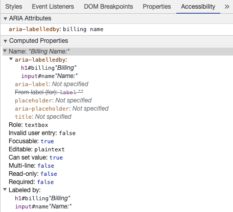
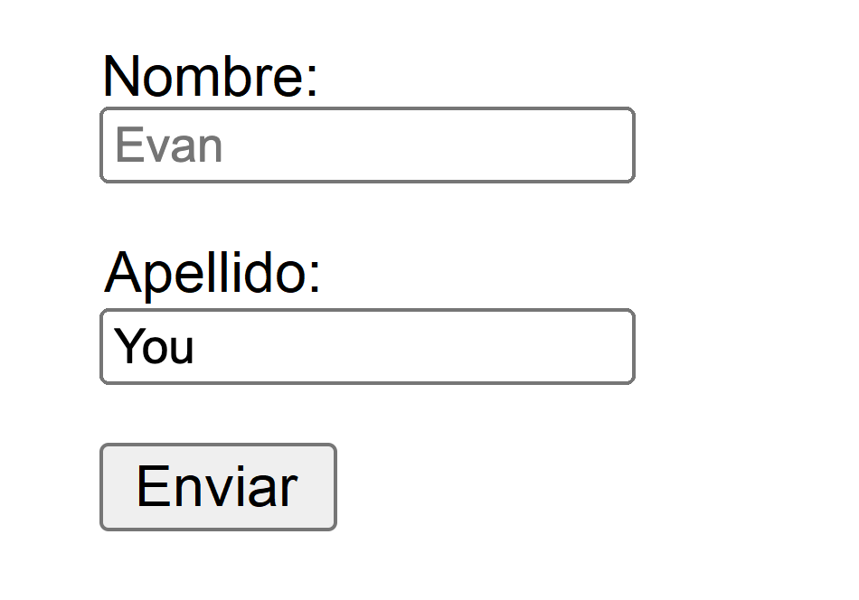

# Accessibility {#accessibility}

Web accessibility (also known as a11y) refers to the practice of creating websites that can be used by anyone — be that a person with a disability, a slow connection, outdated or broken hardware or simply someone in an unfavorable environment. For example, adding subtitles to a video would help both your deaf and hard-of-hearing users and your users who are in a loud environment and can't hear their phone. Similarly, making sure your text isn't too low contrast will help both your low-vision users and your users who are trying to use their phone in bright sunlight.

Ready to start but aren’t sure where?

Checkout the [Planning and managing web accessibility guide](https://www.w3.org/WAI/planning-and-managing/) provided by [World Wide Web Consortium (W3C)](https://www.w3.org/)

## Skip link {#skip-link}

You should add a link at the top of each page that goes directly to the main content area so users can skip content that is repeated on multiple Web pages.

Typically this is done on the top of `App.vue` as it will be the first focusable element on all your pages:

```vue-html
<ul class="skip-links">
  <li>
    <a href="#main" ref="skipLink">Skip to main content</a>
  </li>
</ul>
```

To hide the link unless it is focused, you can add the following style:

```css
.skipLink {
  white-space: nowrap;
  margin: 1em auto;
  top: 0;
  position: fixed;
  left: 50%;
  margin-left: -72px;
  opacity: 0;
}
.skipLink:focus {
  opacity: 1;
  background-color: white;
  padding: 0.5em;
  border: 1px solid black;
}
```

Once a user changes route, bring focus back to the skip link. This can be achieved by calling focus on the skip link's template ref (assuming usage of `vue-router`):

<div class="options-api">

```vue
<script>
export default {
  watch: {
    $route() {
      this.$refs.skipLink.focus()
    }
  }
}
</script>
```

</div>
<div class="composition-api">

```vue
<script setup>
import { ref, watch } from 'vue'
import { useRoute } from 'vue-router'

const route = useRoute()
const skipLink = ref()

watch(
  () => route.path,
  () => {
    skipLink.value.focus()
  }
)
</script>
```

</div>

[Read documentation on skip link to main content](https://www.w3.org/WAI/WCAG21/Techniques/general/G1.html)

## Content Structure {#content-structure}

One of the most important pieces of accessibility is making sure that design can support accessible implementation. Design should consider not only color contrast, font selection, text sizing, and language, but also how the content is structured in the application.

### Headings {#headings}

Users can navigate an application through headings. Having descriptive headings for every section of your application makes it easier for users to predict the content of each section. When it comes to headings, there are a couple of recommended accessibility practices:

- Nest headings in their ranking order: `<h1>` - `<h6>`
- Don’t skip headings within a section
- Use actual heading tags instead of styling text to give the visual appearance of headings

[Read more about headings](https://www.w3.org/TR/UNDERSTANDING-WCAG20/navigation-mechanisms-descriptive.html)

```vue-html
<main role="main" aria-labelledby="main-title">
  <h1 id="main-title">Main title</h1>
  <section aria-labelledby="section-title">
    <h2 id="section-title"> Section Title </h2>
    <h3>Section Subtitle</h3>
    <!-- Content -->
  </section>
  <section aria-labelledby="section-title">
    <h2 id="section-title"> Section Title </h2>
    <h3>Section Subtitle</h3>
    <!-- Content -->
    <h3>Section Subtitle</h3>
    <!-- Content -->
  </section>
</main>
```

### Landmarks {#landmarks}

[Landmarks](https://developer.mozilla.org/en-US/docs/Web/Accessibility/ARIA/Roles/landmark_role) provide programmatic access to sections within an application. Users who rely on assistive technology can navigate to each section of the application and skip over content. You can use [ARIA roles](https://developer.mozilla.org/en-US/docs/Web/Accessibility/ARIA/Roles) to help you achieve this.

| HTML            | ARIA Role            | Landmark Purpose                                                                                                 |
| --------------- | -------------------- | ---------------------------------------------------------------------------------------------------------------- |
| header          | role="banner"        | Prime heading: title of the page                                                                                 |
| nav             | role="navigation"    | Collection of links suitable for use when navigating the document or related documents                           |
| main            | role="main"          | The main or central content of the document.                                                                     |
| footer          | role="contentinfo"   | Information about the parent document: footnotes/copyrights/links to privacy statement                           |
| aside           | role="complementary" | Supports the main content, yet is separated and meaningful on its own content                                    |
| _Not available_ | role="search"        | This section contains the search functionality for the application                                               |
| form            | role="form"          | Collection of form-associated elements                                                                           |
| section         | role="region"        | Content that is relevant and that users will likely want to navigate to. Label must be provided for this element |

:::tip Tip:
It is recommended to use landmark HTML elements with redundant landmark role attributes in order to maximize compatibility with legacy [browsers that don’t support HTML5 semantic elements](https://caniuse.com/#feat=html5semantic).
:::

[Read more about landmarks](https://www.w3.org/TR/wai-aria-1.2/#landmark_roles)

## Semantic Forms {#semantic-forms}

When creating a form, you can use the following elements: `<form>`, `<label>`, `<input>`, `<textarea>`, and `<button>`

Labels are typically placed on top or to the left of the form fields:

```vue-html
<form action="/dataCollectionLocation" method="post" autocomplete="on">
  <div v-for="item in formItems" :key="item.id" class="form-item">
    <label :for="item.id">{{ item.label }}: </label>
    <input
      :type="item.type"
      :id="item.id"
      :name="item.id"
      v-model="item.value"
    />
  </div>
  <button type="submit">Submit</button>
</form>
```

<!-- <common-codepen-snippet title="Simple Form" slug="dyNzzWZ" :height="368" tab="js,result" theme="light" :preview="false" :editable="false" /> -->

Notice how you can include `autocomplete='on'` on the form element and it will apply to all inputs in your form. You can also set different [values for autocomplete attribute](https://developer.mozilla.org/en-US/docs/Web/HTML/Attributes/autocomplete) for each input.

### Labels {#labels}

Provide labels to describe the purpose of all form control; linking `for` and `id`:

```vue-html
<label for="name">Name</label>
<input type="text" name="name" id="name" v-model="name" />
```

<!-- <common-codepen-snippet title="Form Label" slug="XWpaaaj" :height="265" tab="js,result" theme="light" :preview="false" :editable="false" /> -->

If you inspect this element in your chrome developer tools and open the Accessibility tab inside the Elements tab, you will see how the input gets its name from the label:


:::warning Warning:
Though you might have seen labels wrapping the input fields like this:

```vue-html
<label>
  Name:
  <input type="text" name="name" id="name" v-model="name" />
</label>
```

Explicitly setting the labels with a matching id is better supported by assistive technology.
:::

#### `aria-label` {#aria-label}

You can also give the input an accessible name with [`aria-label`](https://developer.mozilla.org/en-US/docs/Web/Accessibility/ARIA/Attributes/aria-label).

```vue-html
<label for="name">Name</label>
<input
  type="text"
  name="name"
  id="name"
  v-model="name"
  :aria-label="nameLabel"
/>
```

<!-- <common-codepen-snippet title="Form ARIA label" slug="NWdvvYQ" :height="265" tab="js,result" theme="light" :preview="false" :editable="false" /> -->

Feel free to inspect this element in Chrome DevTools to see how the accessible name has changed:


#### `aria-labelledby` {#aria-labelledby}

Using [`aria-labelledby`](https://developer.mozilla.org/en-US/docs/Web/Accessibility/ARIA/Attributes/aria-labelledby) is similar to `aria-label` except it is used if the label text is visible on screen. It is paired to other elements by their `id` and you can link multiple `id`s:

```vue-html
<form
  class="demo"
  action="/dataCollectionLocation"
  method="post"
  autocomplete="on"
>
  <h1 id="billing">Billing</h1>
  <div class="form-item">
    <label for="name">Name:</label>
    <input
      type="text"
      name="name"
      id="name"
      v-model="name"
      aria-labelledby="billing name"
    />
  </div>
  <button type="submit">Submit</button>
</form>
```

<!-- <common-codepen-snippet title="Form ARIA labelledby" slug="MWJvvBe" :height="265" tab="js,result" theme="light" :preview="false" :editable="false" /> -->



#### `aria-describedby` {#aria-describedby}

[aria-describedby](https://developer.mozilla.org/en-US/docs/Web/Accessibility/ARIA/Attributes/aria-describedby) is used the same way as `aria-labelledby` except provides a description with additional information that the user might need. This can be used to describe the criteria for any input:

```vue-html
<form
  class="demo"
  action="/dataCollectionLocation"
  method="post"
  autocomplete="on"
>
  <h1 id="billing">Billing</h1>
  <div class="form-item">
    <label for="name">Full Name:</label>
    <input
      type="text"
      name="name"
      id="name"
      v-model="name"
      aria-labelledby="billing name"
      aria-describedby="nameDescription"
    />
    <p id="nameDescription">Please provide first and last name.</p>
  </div>
  <button type="submit">Submit</button>
</form>
```

<!-- <common-codepen-snippet title="Form ARIA describedby" slug="gOgxxQE" :height="265" tab="js,result" theme="light" :preview="false" :editable="false" /> -->

You can see the description by inspecting Chrome DevTools:


### Placeholder {#placeholder}

Avoid using placeholders as they can confuse many users.

One of the issues with placeholders is that they don't meet the [color contrast criteria](https://www.w3.org/WAI/WCAG21/Understanding/contrast-minimum.html) by default; fixing the color contrast makes the placeholder look like pre-populated data in the input fields. Looking at the following example, you can see that the Last Name placeholder which meets the color contrast criteria looks like pre-populated data:



```vue-html
<form
  class="demo"
  action="/dataCollectionLocation"
  method="post"
  autocomplete="on"
>
  <div v-for="item in formItems" :key="item.id" class="form-item">
    <label :for="item.id">{{ item.label }}: </label>
    <input
      type="text"
      :id="item.id"
      :name="item.id"
      v-model="item.value"
      :placeholder="item.placeholder"
    />
  </div>
  <button type="submit">Submit</button>
</form>
```

```css
/* https://www.w3schools.com/howto/howto_css_placeholder.asp */

#lastName::placeholder {
  /* Chrome, Firefox, Opera, Safari 10.1+ */
  color: black;
  opacity: 1; /* Firefox */
}

#lastName:-ms-input-placeholder {
  /* Internet Explorer 10-11 */
  color: black;
}

#lastName::-ms-input-placeholder {
  /* Microsoft Edge */
  color: black;
}
```

It is best to provide all the information the user needs to fill out forms outside any inputs.

### Instructions {#instructions}

When adding instructions for your input fields, make sure to link it correctly to the input.
You can provide additional instructions and bind multiple ids inside an [`aria-labelledby`](https://developer.mozilla.org/en-US/docs/Web/Accessibility/ARIA/Attributes/aria-labelledby). This allows for more flexible design.

```vue-html
<fieldset>
  <legend>Using aria-labelledby</legend>
  <label id="date-label" for="date">Current Date:</label>
  <input
    type="date"
    name="date"
    id="date"
    aria-labelledby="date-label date-instructions"
  />
  <p id="date-instructions">MM/DD/YYYY</p>
</fieldset>
```

Alternatively, you can attach the instructions to the input with [`aria-describedby`](https://developer.mozilla.org/en-US/docs/Web/Accessibility/ARIA/Attributes/aria-describedby):

```vue-html
<fieldset>
  <legend>Using aria-describedby</legend>
  <label id="dob" for="dob">Date of Birth:</label>
  <input type="date" name="dob" id="dob" aria-describedby="dob-instructions" />
  <p id="dob-instructions">MM/DD/YYYY</p>
</fieldset>
```

<!-- <common-codepen-snippet title="Form Instructions" slug="WNREEqv" :height="265" tab="js,result" theme="light" :preview="false" :editable="false" /> -->

### Hiding Content {#hiding-content}

Usually it is not recommended to visually hide labels, even if the input has an accessible name. However, if the functionality of the input can be understood with surrounding content, then we can hide the visual label.

Let's look at this search field:

```vue-html
<form role="search">
  <label for="search" class="hidden-visually">Search: </label>
  <input type="text" name="search" id="search" v-model="search" />
  <button type="submit">Search</button>
</form>
```

We can do this because the search button will help visual users identify the purpose of the input field.

We can use CSS to visually hide elements but keep them available for assistive technology:

```css
.hidden-visually {
  position: absolute;
  overflow: hidden;
  white-space: nowrap;
  margin: 0;
  padding: 0;
  height: 1px;
  width: 1px;
  clip: rect(0 0 0 0);
  clip-path: inset(100%);
}
```

<!-- <common-codepen-snippet title="Form Search" slug="QWdMqWy" :height="265" tab="js,result" theme="light" :preview="false" :editable="false" /> -->

#### `aria-hidden="true"` {#aria-hidden-true}

Adding `aria-hidden="true"` will hide the element from assistive technology but leave it visually available for other users. Do not use it on focusable elements, purely on decorative, duplicated or offscreen content.

```vue-html
<p>This is not hidden from screen readers.</p>
<p aria-hidden="true">This is hidden from screen readers.</p>
```

### Buttons {#buttons}

When using buttons inside a form, you must set the type to prevent submitting the form.
You can also use an input to create buttons:

```vue-html
<form action="/dataCollectionLocation" method="post" autocomplete="on">
  <!-- Buttons -->
  <button type="button">Cancel</button>
  <button type="submit">Submit</button>

  <!-- Input buttons -->
  <input type="button" value="Cancel" />
  <input type="submit" value="Submit" />
</form>
```

<!-- <common-codepen-snippet title="Form Buttons" slug="JjEyrYZ" :height="467" tab="js,result" theme="light" :preview="false" :editable="false" /> -->

### Functional Images {#functional-images}

You can use this technique to create functional images.

- Input fields

  - These images will act as a submit type button on forms

  ```vue-html
  <form role="search">
    <label for="search" class="hidden-visually">Search: </label>
    <input type="text" name="search" id="search" v-model="search" />
    <input
      type="image"
      class="btnImg"
      src="https://img.icons8.com/search"
      alt="Search"
    />
  </form>
  ```

- Icons

```vue-html
<form role="search">
  <label for="searchIcon" class="hidden-visually">Search: </label>
  <input type="text" name="searchIcon" id="searchIcon" v-model="searchIcon" />
  <button type="submit">
    <i class="fas fa-search" aria-hidden="true"></i>
    <span class="hidden-visually">Search</span>
  </button>
</form>
```

<!-- <common-codepen-snippet title="Functional Images" slug="jOyLGqM" :height="265" tab="js,result" theme="light" :preview="false" :editable="false" /> -->

## Standards {#standards}

The World Wide Web Consortium (W3C) Web Accessibility Initiative (WAI) develops web accessibility standards for the different components:

- [User Agent Accessibility Guidelines (UAAG)](https://www.w3.org/WAI/standards-guidelines/uaag/)
  - web browsers and media players, including some aspects of assistive technologies
- [Authoring Tool Accessibility Guidelines (ATAG)](https://www.w3.org/WAI/standards-guidelines/atag/)
  - authoring tools
- [Web Content Accessibility Guidelines (WCAG)](https://www.w3.org/WAI/standards-guidelines/wcag/)
  - web content - used by developers, authoring tools, and accessibility evaluation tools

### Web Content Accessibility Guidelines (WCAG) {#web-content-accessibility-guidelines-wcag}

[WCAG 2.1](https://www.w3.org/TR/WCAG21/) extends on [WCAG 2.0](https://www.w3.org/TR/WCAG20/) and allows implementation of new technologies by addressing changes to the web. The W3C encourages use of the most current version of WCAG when developing or updating Web accessibility policies.

#### WCAG 2.1 Four Main Guiding Principles (abbreviated as POUR): {#wcag-2-1-four-main-guiding-principles-abbreviated-as-pour}

- [Perceivable](https://www.w3.org/TR/WCAG21/#perceivable)
  - Users must be able to perceive the information being presented
- [Operable](https://www.w3.org/TR/WCAG21/#operable)
  - Interface forms, controls, and navigation are operable
- [Understandable](https://www.w3.org/TR/WCAG21/#understandable)
  - Information and the operation of user interface must be understandable to all users
- [Robust](https://www.w3.org/TR/WCAG21/#robust)
  - Users must be able to access the content as technologies advance

#### Web Accessibility Initiative – Accessible Rich Internet Applications (WAI-ARIA) {#web-accessibility-initiative-–-accessible-rich-internet-applications-wai-aria}

W3C's WAI-ARIA provides guidance on how to build dynamic content and advanced user interface controls.

- [Accessible Rich Internet Applications (WAI-ARIA) 1.2](https://www.w3.org/TR/wai-aria-1.2/)
- [WAI-ARIA Authoring Practices 1.2](https://www.w3.org/TR/wai-aria-practices-1.2/)

## Resources {#resources}

### Documentation {#documentation}

- [WCAG 2.0](https://www.w3.org/TR/WCAG20/)
- [WCAG 2.1](https://www.w3.org/TR/WCAG21/)
- [Accessible Rich Internet Applications (WAI-ARIA) 1.2](https://www.w3.org/TR/wai-aria-1.2/)
- [WAI-ARIA Authoring Practices 1.2](https://www.w3.org/TR/wai-aria-practices-1.2/)

### Assistive Technologies {#assistive-technologies}

- Screen Readers
  - [NVDA](https://www.nvaccess.org/download/)
  - [VoiceOver](https://www.apple.com/accessibility/mac/vision/)
  - [JAWS](https://www.freedomscientific.com/products/software/jaws/?utm_term=jaws%20screen%20reader&utm_source=adwords&utm_campaign=All+Products&utm_medium=ppc&hsa_tgt=kwd-394361346638&hsa_cam=200218713&hsa_ad=296201131673&hsa_kw=jaws%20screen%20reader&hsa_grp=52663682111&hsa_net=adwords&hsa_mt=e&hsa_src=g&hsa_acc=1684996396&hsa_ver=3&gclid=Cj0KCQjwnv71BRCOARIsAIkxW9HXKQ6kKNQD0q8a_1TXSJXnIuUyb65KJeTWmtS6BH96-5he9dsNq6oaAh6UEALw_wcB)
  - [ChromeVox](https://chrome.google.com/webstore/detail/chromevox-classic-extensi/kgejglhpjiefppelpmljglcjbhoiplfn?hl=en)
- Zooming Tools
  - [MAGic](https://www.freedomscientific.com/products/software/magic/)
  - [ZoomText](https://www.zoomtext.com/)
  - [Magnifier](https://support.microsoft.com/en-us/help/11542/windows-use-magnifier-to-make-things-easier-to-see)

### Testing {#testing}

- Automated Tools
  - [Lighthouse](https://chrome.google.com/webstore/detail/lighthouse/blipmdconlkpinefehnmjammfjpmpbjk)
  - [WAVE](https://chrome.google.com/webstore/detail/wave-evaluation-tool/jbbplnpkjmmeebjpijfedlgcdilocofh)
- Color Tools
  - [WebAim Color Contrast](https://webaim.org/resources/contrastchecker/)
  - [WebAim Link Color Contrast](https://webaim.org/resources/linkcontrastchecker)
- Other Helpful Tools
  - [HeadingMap](https://chrome.google.com/webstore/detail/headingsmap/flbjommegcjonpdmenkdiocclhjacmbi?hl=en…)
  - [Color Oracle](https://colororacle.org)
  - [Focus Indicator](https://chrome.google.com/webstore/detail/focus-indicator/heeoeadndnhebmfebjccbhmccmaoedlf?hl=en-US…)
  - [NerdeFocus](https://chrome.google.com/webstore/detail/nerdefocus/lpfiljldhgjecfepfljnbjnbjfhennpd?hl=en-US…)

### Users {#users}

The World Health Organization estimates that 15% of the world's population has some form of disability, 2-4% of them severely so. That is an estimated 1 billion people worldwide; making people with disabilities the largest minority group in the world.

There are a huge range of disabilities, which can be divided roughly into four categories:

- _[Visual](https://webaim.org/articles/visual/)_ - These users can benefit from the use of screen readers, screen magnification, controlling screen contrast, or braille display.
- _[Auditory](https://webaim.org/articles/auditory/)_ - These users can benefit from captioning, transcripts or sign language video.
- _[Motor](https://webaim.org/articles/motor/)_ - These users can benefit from a range of [assistive technologies for motor impairments](https://webaim.org/articles/motor/assistive): voice recognition software, eye tracking, single-switch access, head wand, sip and puff switch, oversized trackball mouse, adaptive keyboard or other assistive technologies.
- _[Cognitive](https://webaim.org/articles/cognitive/)_ - These users can benefit from supplemental media, structural organization of content, clear and simple writing.

Check out the following links from WebAim to understand from users:

- [Web Accessibility Perspectives: Explore the Impact and Benefits for Everyone](https://www.w3.org/WAI/perspective-videos/)
- [Stories of Web Users](https://www.w3.org/WAI/people-use-web/user-stories/)
