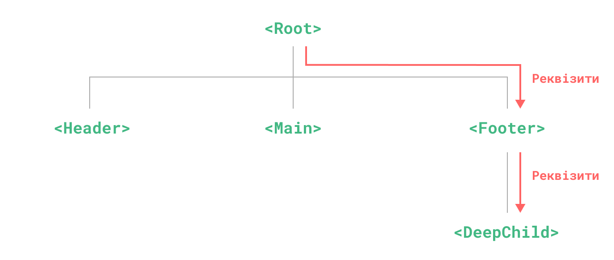
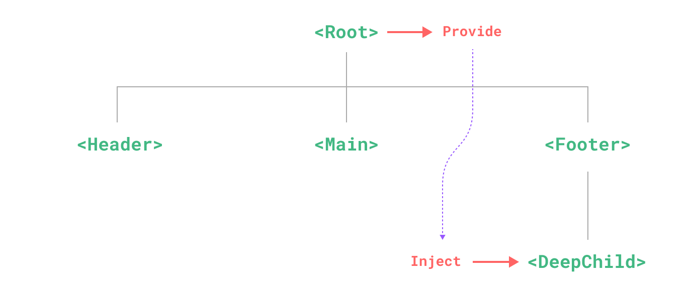

# Provide / Inject {#provide-inject}

> This page assumes you've already read the [Components Basics](/guide/essentials/component-basics). Read that first if you are new to components.

## Prop Drilling {#prop-drilling}

Usually, when we need to pass data from the parent to a child component, we use [props](/guide/components/props). However, imagine the case where we have a large component tree, and a deeply nested component needs something from a distant ancestor component. With only props, we would have to pass the same prop across the entire parent chain:



<!-- https://www.figma.com/file/yNDTtReM2xVgjcGVRzChss/prop-drilling -->

Notice although the `<Footer>` component may not care about these props at all, it still needs to declare and pass them along just so `<DeepChild>` can access them. If there is a longer parent chain, more components would be affected along the way. This is called "props drilling" and definitely isn't fun to deal with.

We can solve props drilling with `provide` and `inject`. A parent component can serve as a **dependency provider** for all its descendants. Any component in the descendant tree, regardless of how deep it is, can **inject** dependencies provided by components up in its parent chain.



<!-- https://www.figma.com/file/PbTJ9oXis5KUawEOWdy2cE/provide-inject -->

## Provide {#provide}

<div class="composition-api">

To provide data to a component's descendants, use the [`provide()`](/api/composition-api-dependency-injection.html#provide) function:

```vue
<script setup>
import { provide } from 'vue'

provide(/* key */ 'message', /* value */ 'hello!')
</script>
```

If not using `<script setup>`, make sure `provide()` is called synchronously inside `setup()`:

```js
import { provide } from 'vue'

export default {
  setup() {
    provide(/* key */ 'message', /* value */ 'hello!')
  }
}
```

The `provide()` function accepts two arguments. The first argument is called the **injection key**, which can be a string or a `Symbol`. The injection key is used by descendant components to lookup the desired value to inject. A single component can call `provide()` multiple times with different injection keys to provide different values.

The second argument is the provided value. The value can be of any type, including reactive state such as refs:

```js
import { ref, provide } from 'vue'

const count = ref(0)
provide('key', count)
```

Providing reactive values allows the descendant components using the provided value to establish a reactive connection to the provider component.

</div>

<div class="options-api">

To provide data to a component's descendants, use the [`provide`](/api/options-composition.html#provide) option:

```js
export default {
  provide: {
    message: 'hello!'
  }
}
```

For each property in the `provide` object, the key is used by child components to locate the correct value to inject, while the value is what ends up being injected.

If we need to provide per-instance state, for example data declared via the `data()`, then `provide` must use a function value:

```js{7-12}
export default {
  data() {
    return {
      message: 'hello!'
    }
  },
  provide() {
    // use function syntax so that we can access `this`
    return {
      message: this.message
    }
  }
}
```

However, do note this does **not** make the injection reactive. We will discuss [making injections reactive](#working-with-reactivity) below.

</div>

## App-level Provide {#app-level-provide}

In addition to providing data in a component, we can also provide at the app level:

```js
import { createApp } from 'vue'

const app = createApp({})

app.provide(/* key */ 'message', /* value */ 'hello!')
```

App-level provides are available to all components rendered in the app. This is especially useful when writing [plugins](/guide/reusability/plugins.html), as plugins typically wouldn't be able to provide values using components.

## Inject {#inject}

<div class="composition-api">

To inject data provided by an ancestor component, use the [`inject()`](/api/composition-api-dependency-injection.html#inject) function:

```vue
<script setup>
import { inject } from 'vue'

const message = inject('message')
</script>
```

If the provided value is a ref, it will be injected as-is and will **not** be automatically unwrapped. This allows the injector component to retain the reactivity connection to the provider component.

[Full provide + inject Example with Reactivity](https://sfc.vuejs.org/#eyJBcHAudnVlIjoiPHNjcmlwdCBzZXR1cD5cbmltcG9ydCB7IHJlZiwgcHJvdmlkZSB9IGZyb20gJ3Z1ZSdcbmltcG9ydCBDaGlsZCBmcm9tICcuL0NoaWxkLnZ1ZSdcblxuLy8gYnkgcHJvdmlkaW5nIGEgcmVmLCB0aGUgR3JhbmRDaGlsZFxuLy8gY2FuIHJlYWN0IHRvIGNoYW5nZXMgaGFwcGVuaW5nIGhlcmUuXG5jb25zdCBtZXNzYWdlID0gcmVmKCdoZWxsbycpXG5wcm92aWRlKCdtZXNzYWdlJywgbWVzc2FnZSlcbjwvc2NyaXB0PlxuXG48dGVtcGxhdGU+XG4gIDxpbnB1dCB2LW1vZGVsPVwibWVzc2FnZVwiPlxuICA8Q2hpbGQgLz5cbjwvdGVtcGxhdGU+IiwiaW1wb3J0LW1hcC5qc29uIjoie1xuICBcImltcG9ydHNcIjoge1xuICAgIFwidnVlXCI6IFwiaHR0cHM6Ly9zZmMudnVlanMub3JnL3Z1ZS5ydW50aW1lLmVzbS1icm93c2VyLmpzXCJcbiAgfVxufSIsIkNoaWxkLnZ1ZSI6IjxzY3JpcHQgc2V0dXA+XG5pbXBvcnQgR3JhbmRDaGlsZCBmcm9tICcuL0dyYW5kQ2hpbGQudnVlJ1xuPC9zY3JpcHQ+XG5cbjx0ZW1wbGF0ZT5cbiAgPEdyYW5kQ2hpbGQgLz5cbjwvdGVtcGxhdGU+IiwiR3JhbmRDaGlsZC52dWUiOiI8c2NyaXB0IHNldHVwPlxuaW1wb3J0IHsgaW5qZWN0IH0gZnJvbSAndnVlJ1xuXG5jb25zdCBtZXNzYWdlID0gaW5qZWN0KCdtZXNzYWdlJylcbjwvc2NyaXB0PlxuXG48dGVtcGxhdGU+XG4gIDxwPlxuICAgIE1lc3NhZ2UgdG8gZ3JhbmQgY2hpbGQ6IHt7IG1lc3NhZ2UgfX1cbiAgPC9wPlxuPC90ZW1wbGF0ZT4ifQ==)

Again, if not using `<script setup>`, `inject()` should only be called synchronously inside `setup()`:

```js
import { inject } from 'vue'

export default {
  setup() {
    const message = inject('message')
    return { message }
  }
}
```

</div>

<div class="options-api">

To inject data provided by an ancestor component, use the [`inject`](/api/options-composition.html#inject) option:

```js
export default {
  inject: ['message'],
  created() {
    console.log(this.message) // injected value
  }
}
```

Injections are resolved **before** the component's own state, so you can access injected properties in `data()`:

```js
export default {
  inject: ['message'],
  data() {
    return {
      // initial data based on injected value
      fullMessage: this.message
    }
  }
}
```

[Full provide + inject example](https://sfc.vuejs.org/#eyJBcHAudnVlIjoiPHNjcmlwdD5cbmltcG9ydCBDaGlsZCBmcm9tICcuL0NoaWxkLnZ1ZSdcblxuZXhwb3J0IGRlZmF1bHQge1xuICBjb21wb25lbnRzOiB7IENoaWxkIH0sXG4gIHByb3ZpZGUoKSB7XG4gICAgcmV0dXJuIHtcbiAgICAgIG1lc3NhZ2U6ICdoZWxsbydcbiAgICB9XG4gIH1cbn1cbjwvc2NyaXB0PlxuXG48dGVtcGxhdGU+XG4gIDxDaGlsZCAvPlxuPC90ZW1wbGF0ZT4iLCJpbXBvcnQtbWFwLmpzb24iOiJ7XG4gIFwiaW1wb3J0c1wiOiB7XG4gICAgXCJ2dWVcIjogXCJodHRwczovL3NmYy52dWVqcy5vcmcvdnVlLnJ1bnRpbWUuZXNtLWJyb3dzZXIuanNcIlxuICB9XG59IiwiQ2hpbGQudnVlIjoiPHNjcmlwdD5cbmltcG9ydCBHcmFuZENoaWxkIGZyb20gJy4vR3JhbmRDaGlsZC52dWUnXG5cbmV4cG9ydCBkZWZhdWx0IHtcbiAgY29tcG9uZW50czoge1xuICAgIEdyYW5kQ2hpbGRcbiAgfVxufVxuPC9zY3JpcHQ+XG5cbjx0ZW1wbGF0ZT5cbiAgPEdyYW5kQ2hpbGQgLz5cbjwvdGVtcGxhdGU+IiwiR3JhbmRDaGlsZC52dWUiOiI8c2NyaXB0PlxuZXhwb3J0IGRlZmF1bHQge1xuICBpbmplY3Q6IFsnbWVzc2FnZSddXG59XG48L3NjcmlwdD5cblxuPHRlbXBsYXRlPlxuICA8cD5cbiAgICBNZXNzYWdlIHRvIGdyYW5kIGNoaWxkOiB7eyBtZXNzYWdlIH19XG4gIDwvcD5cbjwvdGVtcGxhdGU+In0=)

### Injection Aliasing \* {#injection-aliasing}

When using the array syntax for `inject`, the injected properties are exposed on the component instance using the same key. In the example above, the property was provided under the key `"message"`, and injected as `this.message`. The local key is the same as the injection key.

If we want to inject the property using a different local key, we need to use the object syntax for the `inject` option:

```js
export default {
  inject: {
    /* local key */ localMessage: {
      from: /* injection key */ 'message'
    }
  }
}
```

Here, the component will locate a property provided with the key `"message"`, and then expose it as `this.localMessage`.

</div>

### Injection Default Values {#injection-default-values}

By default, `inject` assumes that the injected key is provided somewhere in the parent chain. In the case where the key is not provided, there will be a runtime warning.

If we want to make an injected property work with optional providers, we need to declare a default value, similar to props:

<div class="composition-api">

```js
// `value` will be "default value"
// if no data matching "message" was provided
const value = inject('message', 'default value')
```

In some cases, the default value may need to be created by calling a function or instantiating a new class. To avoid unnecessary computation or side effects in case the optional value is not used, we can use a factory function for creating the default value:

```js
const value = inject('key', () => new ExpensiveClass())
```

</div>

<div class="options-api">

```js
export default {
  // object syntax is required
  // when declaring default values for injections
  inject: {
    message: {
      from: 'message', // this is optional if using the same key for injection
      default: 'default value'
    },
    user: {
      // use a factory function for non-primitive values that are expensive
      // to create, or ones that should be unique per component instance.
      default: () => ({ name: 'John' })
    }
  }
}
```

</div>

## Working with Reactivity {#working-with-reactivity}

<div class="composition-api">

When using reactive provide / inject values, **it is recommended to keep any mutations to reactive state inside of the _provider_ whenever possible**. This ensures that the provided state and its possible mutations are co-located in the same component, making it easier to maintain in the future.

There may be times when we need to update the data from an injector component. In such cases, we recommend providing a function that is responsible for mutating the state:

```vue{7-9,13}
<!-- inside provider component -->
<script setup>
import { provide, ref } from 'vue'

const location = ref('North Pole')

function updateLocation() {
  location.value = 'South Pole'
}

provide('location', {
  location,
  updateLocation
})
</script>
```

```vue{5}
<!-- in injector component -->
<script setup>
import { inject } from 'vue'

const { location, updateLocation } = inject('location')
</script>

<template>
  <button @click="updateLocation">{{ location }}</button>
</template>
```

Finally, you can wrap the provided value with [`readonly()`](/api/reactivity-core.html#readonly) if you want to ensure that the data passed through `provide` cannot be mutated by the injected component.

```vue
<script setup>
import { ref, provide, readonly } from 'vue'

const count = ref(0)
provide('read-only-count', readonly(count))
</script>
```

</div>

<div class="options-api">

In order to make injections reactively linked to the provider, we need to provide a computed property using the [computed()](/api/reactivity-core.html#computed) function:

```js{10}
import { computed } from 'vue'

export default {
  data() {
    return {
      message: 'hello!'
    }
  },
  provide() {
    return {
      // explicitly provide a computed property
      message: computed(() => this.message)
    }
  }
}
```

[Full provide + inject Example with Reactivity](https://sfc.vuejs.org/#eyJBcHAudnVlIjoiPHNjcmlwdD5cbmltcG9ydCBDaGlsZCBmcm9tICcuL0NoaWxkLnZ1ZSdcbmltcG9ydCB7IGNvbXB1dGVkIH0gZnJvbSAndnVlJ1xuXG5leHBvcnQgZGVmYXVsdCB7XG4gIGNvbXBvbmVudHM6IHsgQ2hpbGQgfSxcbiAgZGF0YSgpIHtcbiAgICByZXR1cm4ge1xuICAgICAgbWVzc2FnZTogJ2hlbGxvJ1xuICAgIH1cbiAgfSxcbiAgcHJvdmlkZSgpIHtcbiAgICByZXR1cm4ge1xuICAgICAgbWVzc2FnZTogY29tcHV0ZWQoKCkgPT4gdGhpcy5tZXNzYWdlKVxuICAgIH1cbiAgfVxufVxuPC9zY3JpcHQ+XG5cbjx0ZW1wbGF0ZT5cbiAgPGlucHV0IHYtbW9kZWw9XCJtZXNzYWdlXCI+XG4gIDxDaGlsZCAvPlxuPC90ZW1wbGF0ZT4iLCJpbXBvcnQtbWFwLmpzb24iOiJ7XG4gIFwiaW1wb3J0c1wiOiB7XG4gICAgXCJ2dWVcIjogXCJodHRwczovL3NmYy52dWVqcy5vcmcvdnVlLnJ1bnRpbWUuZXNtLWJyb3dzZXIuanNcIlxuICB9XG59IiwiQ2hpbGQudnVlIjoiPHNjcmlwdD5cbmltcG9ydCBHcmFuZENoaWxkIGZyb20gJy4vR3JhbmRDaGlsZC52dWUnXG5cbmV4cG9ydCBkZWZhdWx0IHtcbiAgY29tcG9uZW50czoge1xuICAgIEdyYW5kQ2hpbGRcbiAgfVxufVxuPC9zY3JpcHQ+XG5cbjx0ZW1wbGF0ZT5cbiAgPEdyYW5kQ2hpbGQgLz5cbjwvdGVtcGxhdGU+IiwiR3JhbmRDaGlsZC52dWUiOiI8c2NyaXB0PlxuZXhwb3J0IGRlZmF1bHQge1xuICBpbmplY3Q6IFsnbWVzc2FnZSddXG59XG48L3NjcmlwdD5cblxuPHRlbXBsYXRlPlxuICA8cD5cbiAgICBNZXNzYWdlIHRvIGdyYW5kIGNoaWxkOiB7eyBtZXNzYWdlIH19XG4gIDwvcD5cbjwvdGVtcGxhdGU+In0=)

The `computed()` function is typically used in Composition API components, but can also be used to complement certain use cases in Options API. You can learn more about its usage by reading the [Reactivity Fundamentals](/guide/essentials/reactivity-fundamentals.html) and [Computed Properties](/guide/essentials/computed.html) with the API Preference set to Composition API.

:::warning Temporary Config Required
The above usage requires setting `app.config.unwrapInjectedRef = true` to make injections automatically unwrap computed refs. This will become the default behavior in Vue 3.3 and this config is introduced temporarily to avoid breakage. It will no longer be required after 3.3.
:::

</div>

## Working with Symbol Keys {#working-with-symbol-keys}

So far, we have been using string injection keys in the examples. If you are working in a large application with many dependency providers, or you are authoring components that are going to be used by other developers, it is best to use Symbol injection keys to avoid potential collisions.

It's recommended to export the Symbols in a dedicated file:

```js
// keys.js
export const myInjectionKey = Symbol()
```

<div class="composition-api">

```js
// in provider component
import { provide } from 'vue'
import { myInjectionKey } from './keys.js'

provide(myInjectionKey, {
  /* data to provide */
})
```

```js
// in injector component
import { inject } from 'vue'
import { myInjectionKey } from './keys.js'

const injected = inject(myInjectionKey)
```

See also: [Typing Provide / Inject](/guide/typescript/composition-api.html#typing-provide-inject) <sup class="vt-badge ts" />

</div>

<div class="options-api">

```js
// in provider component
import { myInjectionKey } from './keys.js'

export default {
  provide() {
    return {
      [myInjectionKey]: {
        /* data to provide */
      }
    }
  }
}
```

```js
// in injector component
import { myInjectionKey } from './keys.js'

export default {
  inject: {
    injected: { from: myInjectionKey }
  }
}
```

</div>
