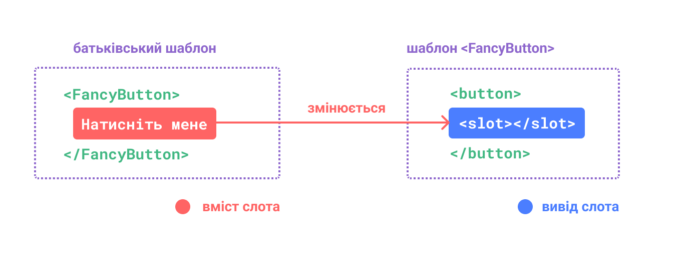
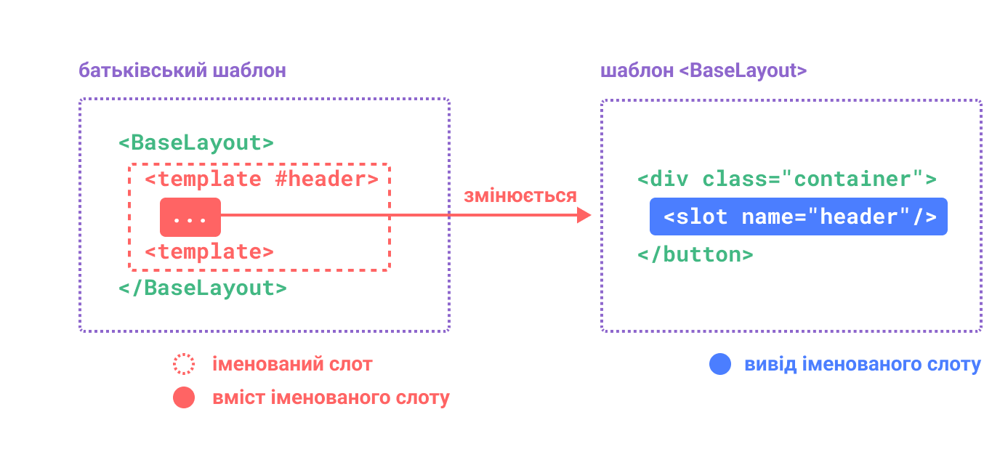
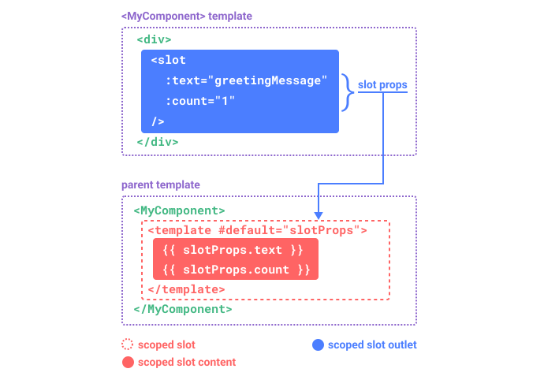

# Слоти {#slots}

> Ця сторінка передбачає, що ви вже прочитали [Основи компонентів](/guide/essentials/component-basics). Прочитайте це спочатку, якщо ви новачок у компонентах.

<VueSchoolLink href="https://vueschool.io/lessons/vue-3-component-slots" title="Безкоштовний урок про слоти Vue.js"/>

## Вміст та вивід слота {#slot-content-and-outlet}

Ми дізналися, що компоненти можуть приймати властивості, якими можуть бути значення JavaScript будь-якого типу. Але як щодо вмісту шаблону? У деяких випадках ми можемо захотіти передати фрагмент шаблону в дочірній компонент і дозволити дочірньому компоненту відтворити фрагмент у своєму власному шаблоні.

Наприклад, у нас може бути компонент `<FancyButton>`, який підтримує наступне використання:

```vue-html{2}
<FancyButton>
  Натисніть мене! <!-- вміст слота -->
</FancyButton>
```

Шаблон `<FancyButton>` виглядає так:

```vue-html{2}
<button class="fancy-btn">
  <slot></slot> <!-- вивід слота -->
</button>
```

Елемент `<slot>` — це вивід слота, який вказує, де має наданий батьком **вміст слота** відтворюватися.



<!-- https://www.figma.com/file/75OMLip2mV2aUBRZwx0CCU/slot-(Copy) -->

І остаточний відрендерений DOM:

```html
<button class="fancy-btn">Натисніть мене!</button>
```

<div class="composition-api">

[Спробуйте в пісочниці](https://sfc.vuejs.org/#eNp9Us1O3DAQfpWpUUUrrZOysP1JU6T20KfwJZs4aWhiW2OHgtAe2HPP3HgHhEBC4ucZnDdinKBVAImb55v5vpn5xifspzHRYSdZwlKbY20cWOk6sy9U3RqNDn5nKj/+1TmnFZSoW9iO4gkWyNtCpfHIJh4FTramyZykCCCdVA8AgD/3F/3a3/Sn/r4/69f9f/B3/trf+2tI33EO/tLfUeK0XwPV3PoHqr4AzgNfuHQ6AEFpvGnIZmycm7eZiQ6sVrTZSegqnhJWsAQGJGA0fYgF++OcsUkc2zIPKx3YSGMV0yvCTrm6lZG0LV+i/mclkrBgs4lGTOChRI5SFRIlvqX5ovSVbpBdCbWiVV74HI703NrleJe8yaz9IVgZ6vnSKcGGPFllG+3i/Y2rN/6yP/NXr1wNpo5iz/0czmndcROe0UZ/NDDXjcYEtsqy/B7iZZb/rVB3qkigqZXMkFeYFbVU7sPuzqKQ1Qy29ubF7rc5zBfvKfi890WW5ceRrZEMSUBpJQfAZEVRqyqBhTmCnU/maEDbDKtaDeCExkOfzibw9QnOO7RhOKNr5SQSRp7SLx1WYatH2WsbbQ==)

</div>
<div class="options-api">

[Спробуйте в пісочниці](https://sfc.vuejs.org/#eNp9Us1O3DAQfpWpUUUrrZOysP1JU6T20KfwxZs4aWhiW7ZDF604sOeeufUdECoSUqHP4LxRxw5dZUFC8sHzzcw3M9/MmnzWOjntBclIbgvTaHfMZNNpZRx85bI4+9I7pyRURnWwn6QTLKTtMwnApFjFhFJUvG8drANaKGSRQjqbwXqH65xJfHm6rYeGE51uuRNoAeST6AgA+F/+atj42+HC3w+Xw2b4Cf7O3/h7fwP5C0rBX/s7dFwMG8CYP/4vRl8BpSGfuXzaOEJ5ui1IZmScl3ZcJydWSdQiTsAeHJYRHGHsgxGcOtiMfHNO2yxNbVUEKU5sokyd4i8xvXRNJxJhO7o06ocVBokZmU04UgRPhaFGyFIYYZ7jfBT6hDfQBlFxlEf7CWvdlXY57qBoubWfGKlCPF06yUj0o1S2VS493qp666+HS//7iapB1JFsV8+4TuvO2vBNtvz/j6JVJoO9qqo+BnvJi++1Ub0sM2gbKbihteFlg2fz6vBgUYp6BntH8/Lwwxzmi5dovD16J6rq9ZitDAqSgcQ7i4DmZdnIOoOFXsHBG72KaMdN3cgITtJoqNPjcb5/gIve2NCcVo10wiA2XmkchZz/AxZWLcg=)

</div>

Завдяки слотам, `<FancyButton>` відповідає за візуалізацію зовнішнього `<button>` (та його гарного стилю), тоді як внутрішній вміст надається батьківським компонентом.

Ще один спосіб зрозуміти слоти – порівняти їх із функціями JavaScript:

```js
// батьківський компонент передає вміст слота
FancyButton('Натисніть мене!')

// FancyButton рендерить вміст слота у власному шаблоні
function FancyButton(slotContent) {
  return `<button class="fancy-btn">
      ${slotContent}
    </button>`
}
```

Вміст слота не обмежується лише текстом. Це може бути будь-який дійсний вміст шаблону. Наприклад, ми можемо передати кілька елементів або навіть інші компоненти:

```vue-html
<FancyButton>
  <span style="color:red">Натисніть мене!</span>
  <AwesomeIcon name="plus" />
</FancyButton>
```

<div class="composition-api">

[Спробуйте в пісочниці](https://sfc.vuejs.org/#eNp9U11O3DAQvsoQVNFKm6QsbH/SFIk+VOod8uJNnDQ0sS3bAVZopRZeK/FS8cZbD4AQqKtStlewr9AL9AodJ9tVWARP9nyZ+cbzzZcjb1eIYL+hXuTFKpWl0KCobsROwspacKnhPWHp5F2jNWeQS17DRhD2MFe8sUzePaCK1/RD2kvuYYvkOOxaYRMMNK1FRTTFCCDuUbcAgDk3F/bYzOwXc2vP7LH9CuaXuTa35hoTEh33n/MQSawEYaD0pKJvEy/lFZdROiEs8XYe4V8DfCoW/ifpjxd2rVaax+FyHG/gdar4NRHBnuIMRT5yRcnig0q8CFrEYaiNixPvo9ZCRWGo8tQJtqcCLosQb4FsmC5rGlBV+2PJDxSVSJx4gx5HiOA+lb6kLKOSysc4V1Lv8TraacKmOMrKyp1f7i5u3FkkrYhSKHHu8v2xdgq3M+tYVVw71dzKuuy7grVuaFeE12BJ0CnUrQzW8zx/4+IxST8Vkjcsi6AqGSXSLyTJSsr0063NUUaLAaxvD7Ot10MYjp5g8GL7Jc3zZ101lzhxBIwz2gKCZFnJighG4hA2n4vDFq2JLErWgr0y3/VpVASvFnDaSOUeJ3jJNJWIoWjonHYU1G7lD3Darfk+mEszMz/N3H525kMLzs2lPbHf0H1zQAPiYa7MD3sGeNzYUzC/XSqW3JgLc2VPwPedgksB/5x//zs77Vtw+g+dwYHC)

</div>
<div class="options-api">

[Спробуйте в пісочниці](https://sfc.vuejs.org/#eNp9U11O3DAQvsoQVNFKm6QsbH/SFIk+VOod8uJNnDQ0sS3bgV2tkFp4rcRLxRtvPQBCoK5K2V7BuUIv0Ct0nCxRdouIItnzZeaz55svM2dfCO+wok7ghCqWudB7EctLwaWG94TF03eV1pxBKnkJW57fw2zZVpe8f0QVL+mHuJfcw5bJABGjk6YgoSmpCg0zi8YcWRhlWgUw6x88WCE+jhi+od/dFANNS1EQTTECCHulDYCPuTCX9YmZ11/MXX1en9RfwfwyN+bO3GBGpMN+Uw3ngzyhEoSB0tOCvo2cmBdcBvGUsMjZe+SEDcDbYuE9Sb8bv73y2vGh33XkDJxWXbckwjtQnOGYGr2i5QcVOShYyx05qLGNI+ej1kIFvq/S2Ap/oDwuMx93nqyYzkvqUVW6Y8mPFJVIHDmDHoeP4CGVrqQsoZLKxzjXUv/jtbR2atjKmnWs41ZnN26tFhdEKZQ4tfnuWFuFm551qAqurWp2aG32qmCNIZoR4dbrCO49ZkcGm2mavrHxmMSfMskrlgRQ5IwS6WaSJDm68OnO9iih2QA2d4fJzushDEdPMHix+5Km6bO2mkvsOACGtm0AQZIkZ1kAIzGB7edi0qAlkVnOGrBX5tpzKvT6qyUcV1LZywmeM00lYq3Pm1ZQu7U/yWq34bpgrszc/DSL+rM1H1pwYa7q0/obum8BaEBczLX5UZ8DLrf1GZjfNhVLbs2lua5PwXWtgp2Afy6+/52f9S14/A+D65mt)

</div>

Завдяки слотам, наш `<FancyButton>` є більш гнучким і придатним для повторного використання. Тепер ми можемо використовувати його в різних місцях з різним внутрішнім вмістом, але всі з однаковим стильним оформленням.

Механізм слотів у Vue був натхненний [нативним елементом `<slot>` Веб Компонента](https://developer.mozilla.org/en-US/docs/Web/HTML/Element/slot), але з додатковими можливостями, які ми побачимо пізніше.

## Область візуалізації {#render-scope}

Вміст слота має доступ до області даних батьківського компонента, оскільки він визначений у батьківському компоненті. Наприклад:

```vue-html
<span>{{ message }}</span>
<FancyButton>{{ message }}</FancyButton>
```

Тут обидві інтерполяції <span v-pre>`{{ message }}`</span> відображатимуть однаковий вміст.

Вміст слота **не має** доступу до даних дочірнього компонента. Вирази в шаблонах Vue можуть отримати доступ лише до області, у якій вони визначені, відповідно до лексичного діапазону JavaScript. Іншими словами:

> Вирази в батьківському шаблоні мають доступ лише до батьківської області; вирази в дочірньому шаблоні мають доступ лише до дочірньої області.

## Резервний вміст {#fallback-content}

Бувають випадки, коли для слота корисно вказати резервний вміст (тобто, вміст за замовчуванням), який буде відображатися лише тоді, коли вміст не надано. Наприклад, у компоненті `<SubmitButton>`:

```vue-html
<button type="submit">
  <slot></slot>
</button>
```

Ми можемо захотіти, щоб текст «Надіслати» відображався всередині `<button>`, якщо батьківський елемент не надав вмісту слота. Щоб «Надіслати» резервний вміст, ми можемо розмістити його між тегами `<slot>`:

```vue-html{3}
<button type="submit">
  <slot>
    Надіслати <!-- резервний вміст -->
  </slot>
</button>
```

Тепер, коли ми використовуємо `<SubmitButton>` у батьківському компоненті, не надаючи вмісту для слота:

```vue-html
<SubmitButton />
```

Це відобразить резервний вміст, «Надіслати»:

```html
<button type="submit">Надіслати</button>
```

Але якщо ми надаємо контент:

```vue-html
<SubmitButton>Зберегти</SubmitButton>
```

Тоді замість цього буде відображено наданий вміст:

```html
<button type="submit">Зберегти</button>
```

<div class="composition-api">

[Спробуйте в пісочниці](https://sfc.vuejs.org/#eNqNUs1OAjEQfpXaCxd2eycrib6C114Aiy6hP2lnMYaQiL6DnnwHRIn4xzPMvpHTrjGAieHU6deZrzPfN1N+4lw+qRTv8CIMfOmABQWV60pTamc9sLOqr0s4rQCsYUNvNWvlYhuM5S1pCtHUUyVdQGk37oGiG2PFUZYxXOIa33FT3+C6nte3uMFlfUfoguI1I3iFr7iic4lflPoWKz7r+5jLsqwh2mlGJOzQDyj4oHB+GHkXH/ApdbPC51hf7MxMBYX4nZG3eSNWpnsuHwVrSM5pau7nIUjeYQmJGAkW75JfArjQESIMB1HFUcitvxAU5b4yUGqVq6CzvrdXQXkilry9xSEInCifeWXOlVf+P8691D+8kXYmzYxG2fc2rsaunf1Gf7h26ljykPIlj8YDvYaxjUuQ2gR8xAW+RKGT+tGIZNZBdkugpWrYYth8uyf97BtyLjNU)

</div>
<div class="options-api">

[Спробуйте в пісочниці](https://sfc.vuejs.org/#eNqNUktOwzAQvYrxppsm3lehElyBrTf9uNCqsS17UkBVJQp3gBV3KIWK8usZJjdi7EDVFAlVipTx88wbz3sz5SfWppNC8RbPfM8NLbSlHubWOGBnRTcfwmkBYDQbOJOzRip2wVDYkJoxqdVVLOmrQacYA5sGtGeIRysNvlUBrEYZkJnU9GVi25oOoHI77oCiE2PZUZIwXOIa33FT3uC6nJe3uMFleUfoguI1I3iFr7ii/xK/KPUtVHyW9yGXJUlFVJtGROzQBhR8UDg/jLyND/gUX7PC51Cf1USjgkxsZ+RNXqmd5B2bjrzR5EQUS/5ceMm38klOioez5BcA1reE8INesGHkU+POBUWpKzQMc5UqnyddZy69ckQseXOHQxA4US5xSveVU+4/zr3UP7y/PtIo+8sRtqpuZ7fSH66tOpbcx3zJg/FAt35swhLEZwI+4gJfgtBR/WBENOsguyXQUlVsIaza7kk/+wbf70hG)

</div>

## Іменовані слоти {#named-slots}

Бувають випадки, коли корисно мати кілька виводів в одному компоненті. Наприклад, у компоненті `<BaseLayout>` із таким шаблоном:

```vue-html
<div class="container">
  <header>
    <!-- Тут нам потрібен вміст заголовка -->
  </header>
  <main>
    <!-- Тут нам потрібен основний вміст -->
  </main>
  <footer>
    <!-- Тут ми хочемо вміст нижнього колонтитула -->
  </footer>
</div>
```

Для цих випадків елемент `<slot>` має спеціальний атрибут `name`, за допомогою якого можна призначити унікальний ідентифікатор різним слотам, щоб ви могли визначити, де має відтворюватися вміст:

```vue-html
<div class="container">
  <header>
    <slot name="header"></slot>
  </header>
  <main>
    <slot></slot>
  </main>
  <footer>
    <slot name="footer"></slot>
  </footer>
</div>
```

Вивід `<slot>` без `name` неявно має назву "default".

У батьківському компоненті, що використовує `<BaseLayout>`, нам потрібен спосіб передати кілька фрагментів вмісту слота, кожен з яких націлений на інший вивід слота. Ось де з'являються **іменовані** слоти.

Щоб передати іменований слот, нам потрібно використати елемент `<template>` з директивою `v-slot`, а потім передати назву слота як аргумент `v-slot`:

```vue-html
<BaseLayout>
  <template v-slot:header>
    <!-- вміст для слота заголовка -->
  </template>
</BaseLayout>
```

`v-slot` має спеціальне скорочення `#`, тому `<template v-slot:header>` можна скоротити до просто `<template #header>`. Подумайте про це як про «відобразити цей фрагмент шаблону в слоті 'header' дочірнього компонента».



<!-- https://www.figma.com/file/VE5SL2VDXfKSXPwWqZgYpq/named-slot-(Copy) -->

Ось код, який передає вміст для всіх трьох слотів у `<BaseLayout>` за допомогою скороченого синтаксису:

```vue-html
<BaseLayout>
  <template #header>
    <h1>Тут може бути назва сторінки</h1>
  </template>

  <template #default>
    <p>Абзац для основного змісту.</p>
    <p>And another one.</p>
  </template>

  <template #footer>
    <p>Ось трохи контактної інформації</p>
  </template>
</BaseLayout>
```

Коли компонент приймає як слот за замовчуванням, так і іменовані слоти, усі вузли верхнього рівня, які не є `<template>`, неявно розглядаються як вміст для слота за замовчуванням. Отже, вищесказане також можна записати так:

```vue-html
<BaseLayout>
  <template #header>
    <h1>Тут може бути назва сторінки</h1>
  </template>

  <!-- неявний слот за замовчуванням -->
  <p>Абзац для основного змісту.</p>
  <p>І ще один.</p>

  <template #footer>
    <p>Ось трохи контактної інформації</p>
  </template>
</BaseLayout>
```

Тепер усе всередині елементів `<template>` буде передано до відповідних слотів. Остаточний відтворений HTML буде таким:

```html
<div class="container">
  <header>
    <h1>Тут може бути назва сторінки</h1>
  </header>
  <main>
    <p>Абзац для основного змісту.</p>
    <p>І ще один.</p>
  </main>
  <footer>
    <p>Ось трохи контактної інформації</p>
  </footer>
</div>
```

<div class="composition-api">

[Спробуйте в пісочниці](https://sfc.vuejs.org/#eNp9U8tu00AU/ZUrZ9FNY9NNhIyJBGs+wRvXmRBXtmc0MwmUKlJLoRISEqzaHQu+IOUZhSbfMPNHnLGTxk6gsmT5nnvvOfflM++ZEP5kzLzQi1QqM6FJMT0W/bjMCsGlpueJYi+SUz7WNJS8oAM/2EIu9SAuo6DORRYMzQqRJ5rBIoq2wZUNZOOnzoglAybXODyjo775ai/tWzJ3ZmV+mZ9kbp1t5mSWZmZ+m29mRvYCyMqe22uACzOPAiSuyYOG+p7egA2Tcb4pBC7RN5/NLWhn9orMD/PHfiIwX4B3BSn3/m5WhIA7e+1k7aUfBW46W4Irsh9coSvkz82y4X+4mCHnumo+1u5xVF8g8ZGgco4i3rumF6BdotuZWeCNeuwNubbtOzcATAmFo7Kb/4g6s7WAhtc79OoVd4tE+CeKlziCM5cTrx0q9kKqEIdh1c6OvZHWQoVBoIap2/+J8rl8GeDLl+NSZwXzmSq6x5K/UkyCOPYOGxwBwAmTXclK7J7Jhzh3Qvd4He00LqdopX2T7pzbYxhkE0rzRKmnsZfyUidZ6bQ3Q9u9RJVzTWVSMITXPsTizAHfz7mVExVgbOfvxjciovvl/0Ov9u3rNXKiAP2011n9ekqf5nXDdfBme8dcotSu5iKkI/GaFM+zAXXSNH1SB6Q85zKkTq/XWyNDDKmrsjcspEf+Y1ZUMIaNoioRb/oXR2WiEw==)

</div>
<div class="options-api">

[Спробуйте в пісочниці](https://sfc.vuejs.org/#eNp9U0tu2zAQvcqAXmQTS83GKFTVQLvuEbhRZLpWIJEESbtJgwBJ0wYoUKBdJbsuegKnX8ONfQbyRhlKsi3ZSWBD0LyZeW9+OiWvpAwmY0YiEutUZdL0Kc8KKZSB14lmb5ITMTYwVKKAvSDcQD5pj3IAytlxGT5gw2ScGzj1aCqQgzNudFQB0KDz9hnl+I/DtSgahhUyTwxDCyDexJc2Iis/dEYsGTBV4+gZHfTtD3fpPoC9s0v71/4Be+ttOwO7sFP7z/60U3AXiCzdubtGcG5ncYiJNXnYUN/Rq3vbCMq+/WZvkXbqrsD+tv/dV0DmC+RdopR//rJLwIA7d+1l3WUQh7JFcAXusy90ifkzu2j4ny5mKIQpm6fG/zzVd5T4AqhyjkV88k3PkXaB3U7tHJ9Yj7sB37b76AeAU8LCsbKbR0S92VpAw0v2SXUh3SKRwZEWHK+nXDKtHZqS9dopwUvxNiUjY6SOwlAPU38+RzoQ6m2Ib4Eac5MVLGC66B4q8U4zhcSU7Dc4QgQnTHUV47h7pp7i3Ard4V1dILbSPmn/HbTHMMgmkOaJ1i8pSQU3Sca99mpo25eoc2GAJwXD8MqHsXjmCK/n3MqJC2Rs52/HNyLi9fIf0Kt8u3qNnDjEftrrLD89bU7yquEqeLW9Q6Gw1K4RMoIDeQxa5NkAOmmavqgCUpELFUGn1+vVyBCH1NXZexbBs+A5K0q4+tZLEXJ2D1Emtg4=)

</div>

Знову ж таки, це може допомогти вам краще зрозуміти іменовані слоти за допомогою аналогії функції JavaScript:

```js
// передача кількох фрагментів слота з різними іменами
BaseLayout({
  header: `...`,
  default: `...`,
  footer: `...`
})

// <BaseLayout> відображає їх у різних місцях
function BaseLayout(slots) {
  return `<div class="container">
      <header>${slots.header}</header>
      <main>${slots.default}</main>
      <footer>${slots.footer}</footer>
    </div>`
}
```

## Динамічні назви слотів {#dynamic-slot-names}

[Аргументи динамічних директив](/guide/essentials/template-syntax.md#dynamic-arguments) також спрацюють з `v-slot`, що дозволяє визначати динамічні назви слотів:

```vue-html
<base-layout>
  <template v-slot:[dynamicSlotName]>
    ...
  </template>

  <!-- зі скороченням -->
  <template #[dynamicSlotName]>
    ...
  </template>
</base-layout>
```

Зверніть увагу, що на вираз поширюються [синтаксичні обмеження](/guide/essentials/template-syntax.html#directives) аргументів динамічних директив.

## Обмежені слоти {#scoped-slots}

Як зазначено в розділі [область візуалізації](#render-scope), вміст слота не має доступу до стану в дочірньому компоненті.

Проте є випадки, коли може бути корисно, якщо вміст слота може використовувати дані як з батьківської, так і з дочірньої областей. Щоб досягти цього, нам потрібен спосіб, за допомогою якого дочірній компонент передає дані в слот під час їх рендерингу.

Фактично, ми можемо зробити саме це - ми можемо передати атрибути до виводу так само як передати атрибути до компонента:

```vue-html
<!-- <MyComponent> template -->
<div>
  <slot :text="greetingMessage" :count="1"></slot>
</div>
```

Отримання реквізитів слотів дещо відрізняється при використанні одного слота за замовчуванням порівняно з використанням іменованих слотів. Ми збираємося показати, як отримати реквізити, використовуючи спочатку один слот за замовчуванням завдяки `v-slot` безпосередньо в тегу дочірнього компонента:

```vue-html
<MyComponent v-slot="slotProps">
  {{ slotProps.text }} {{ slotProps.count }}
</MyComponent>
```



<!-- https://www.figma.com/file/zWaGeuSbwolYlz8LArwW8h/scoped-slot-(Copy) -->

<div class="composition-api">

[Спробуйте в пісочниці](https://sfc.vuejs.org/#eNp9kcFOwzAMhl/FymWXNRHXqkNCnCfxALmMziud1iSKvQKqKiEeggfhxI1X2N4IZ52mUtBOif/Yn2P/nboLQbd7VLkqqIx1YCDkfbi1rm6CjwzL13svN4eOYRN9AzNtRloqnllXmKFa6iRgbMJuxZgiLsaENqOd54VV6XiIPpBVkgVguevgImrGF4a+h19i6feC6PuUX4w/IYTCXJqquRr+njWroLfknUzXnZqcH6RpDiclaTJBiq16Yg6UG0ObMo21Je1jZeSmozSuG9RITfYY/TNhFLBV8xHDiNhizCK6NUaM15iT1D/chJUxexllsut/jCq9I4YqInLtqiUSrSqEBcwO38e3w9fh8/hxfL/mkWxzXbdnG4q0b8iTAWLThGoV5CcX5OlGnBOkZA82m4ExNqL/Abv73N4=)

</div>
<div class="options-api">

[Спробуйте в пісочниці](https://sfc.vuejs.org/#eNqFUkFOwzAQ/MrKl4JEY3GNAhLiXIkH+BKSbUjV2Ja9CUVRJMQjeAgnbnyh/RHrpInSgkCKFO94PePZcSvurI2aGkUsEp+50tKt0mVljSNYvdwbXmnUBGtnKlhEcoaFYwulAZTGXX8gx3VabwnagGZjn48HAOaEAeiU5i+Rky4XhJXdpoShomR+g2bpt4ZulAi/B2esV4K7WJ7aFiYwItwRdB2cgJmpmaJjOYBkboIZEjmJiisxeF9WqY023mieS395ddxg0cmOEjyBUCvxRGR9LKVfZ2EsGx8ZV0heRY6Fywoj9NXy0Zlnj46JlbiacUgGG3RLhzpHh+4vzrPWH7zjYNnKWVYnEf+WWJ5SenE5unNItdNjBVA4RCp1sULv0wJjWOy/Dq/7z/3H4f3w1j+EXvnfXDmBvGyO0SUhI4hDaBztmYYSEPfJ8dY1p82U3D08DTlwzMPrvgGJpQEj)

</div>

Реквізити, передані дочірнім слотом, доступні як значення відповідної директиви `v-slot`, доступ до якої можна отримати за допомогою виразів у слоті.

Ви можете розглядати обмежений слот як функцію, яка передається дочірньому компоненту. Потім дочірній компонент викликає його, передаючи властивості як аргументи:

```js
MyComponent({
  // передаємо слот за замовчуванням, але як функцію
  default: (slotProps) => {
    return `${slotProps.text} ${slotProps.count}`
  }
})

function MyComponent(slots) {
  const greetingMessage = 'привіт'
  return `<div>${
    // виклик функції слота за допомогою пропсів!
    slots.default({ text: greetingMessage, count: 1 })
  }</div>`
}
```

Фактично, це дуже близько до того, як компілюються обмежені слоти та як ви б використовували обмежені слоти у користувацьких [функціях візуалізації](/guide/extras/render-function.html).

Зверніть увагу, як `v-slot="slotProps"` відповідає сигнатурі функції слота. Як і з аргументами функції, ми можемо використовувати деструктуризацію у `v-slot`:

```vue-html
<MyComponent v-slot="{ text, count }">
  {{ text }} {{ count }}
</MyComponent>
```

### Іменовані обмежені слоти {#named-scoped-slots}

Іменовані обмежені слоти працюють аналогічно – властивості слота доступні як значення директиви `v-slot`: `v-slot:name="slotProps"`. При використанні скорочення це виглядає так:

```vue-html
<MyComponent>
  <template #header="headerProps">
    {{ headerProps }}
  </template>

  <template #default="defaultProps">
    {{ defaultProps }}
  </template>

  <template #footer="footerProps">
    {{ footerProps }}
  </template>
</MyComponent>
```

Передача реквізитів у іменований слот:

```vue-html
<slot name="header" message="привіт"></slot>
```

Зауважте, що `name` слота не буде включено до реквізитів, оскільки його зарезервовано, тому остаточний `headerProps` буде `{ message: 'привіт' }`.

Якщо ви змішуєте іменовані слоти з обмеженим слотом за промовчанням, вам потрібно використовувати явний тег `<template>` для слота за промовчанням. Спроба розмістити директиву `v-slot` безпосередньо в компоненті призведе до помилки компіляції. Це зроблено для того, щоб уникнути будь-якої двозначності щодо обсягу реквізитів слота за промовчанням. Наприклад:

```vue-html
<!-- Цей шаблон не скомпілюється -->
<template>
  <MyComponent v-slot="{ message }">
    <p>{{ message }}</p>
    <template #footer>
      <!-- повідомлення належить до слота за промовчанням і тут недоступне -->
      <p>{{ message }}</p>
    </template>
  </MyComponent>
</template>
```

Використання явного тегу `<template>` для слота за промовчанням допомагає зрозуміти, що властивість `message` недоступна в іншому слоті:

```vue-html
<template>
  <MyComponent>
    <!-- Використовуйте явний слот за промовчанням -->
    <template #default="{ message }">
      <p>{{ message }}</p>
    </template>

    <template #footer>
      <p>Ось трохи контактної інформації</p>
    </template>
  </MyComponent>
</template>
```

### Приклад гарного списку {#fancy-list-example}

Можливо, вам цікаво, що було б гарним варіантом використання для обмежених слотів. Ось приклад: уявіть компонент `<FancyList>`, який рендерить список елементів - він може інкапсулювати логіку для завантаження віддалених даних, використання даних для відображення списку або навіть розширені функції, такі як розбиття на сторінки або нескінченне прокручування. Однак ми хочемо, щоб він був гнучким щодо того, як виглядає кожен елемент, і залишив стиль кожного елемента батьківському компоненту, який його використовує. Отже, бажане використання може виглядати так:

```vue-html
<FancyList :api-url="url" :per-page="10">
  <template #item="{ body, username, likes }">
    <div class="item">
      <p>{{ body }}</p>
      <p>автор: {{ username }} | {{ likes }} вподобайок</p>
    </div>
  </template>
</FancyList>
```

Усередині `<FancyList>` ми можемо кілька разів візуалізувати той самий `<slot>` з різними даними елемента (зверніть увагу, що ми використовуємо `v-bind`, щоб передати об’єкт як реквізити слота):

```vue-html
<ul>
  <li v-for="item in items">
    <slot name="item" v-bind="item"></slot>
  </li>
</ul>
```

<div class="composition-api">

[Спробуйте в пісочниці](https://sfc.vuejs.org/#eNqFVM1y3EQQfpVGLmrXVbvS2o7BiLWruHDiwIHiYuWgXY02k0ijqZnRgllURUj5CgcgnCiqeADKSSUQYq/zCqM34htptT+Qn4N21d36vp7u/noW3idS+vOSeaE31lPFpSHNTCnPIsFzWShDn8ZievEZ14ZSVeTU84O1xwF7kRgHLRIYGIblMosNg0U03qDDWPJhqbLTyMNv5FEomRrKeMbgORhFXgMApCOgPY5XBBc0KZKLAZWaKRHnbEAZf8A0VWsMUAmf0zSLtQbA4bZiiMqzRctCVTUOXHWb0BqWMxMDZq/s0/p7e1t/FxJQXVYg6VvnWCWvyD61r+ytfYbnCUD/4P/lNvk4wKG6qoLdvmyaCHsnCFObi4yRnhaSJfD47mC0cLi0EGao+TcspJF/wvKPnXNaZIUKae/O4eTk5AiuqpmJIznzBl47x2EeS/++LgQm3VChTU1ARx7qbE8ZeZiosyPvnjFSh0Gg06kb833tF2oW4M1XpTA8Zz7T+XCiiq/QHxBH3mCLI4BzjvEqJhKmmHob538+/R+vo0VFFUrZUd6bJbsgxVKqVoJtRRqJaSEgQ6kKqemUEpZywT53Vv+8t9Jmb0C9TpW9u/sblFOUQ4G3f94GgoDqh/aFvakf2ev6h/pne2NvoYn6MRTxDHq4ts/t0j4n+7dTFJ4lVHVl/2rcy/pHar5a2hf1ZSRQwRdoalGafn+fTs/aiTRp/XmclQzJz9sGt0IOqWd/crnIiZAaDd6AuqUHpzvdNVSMnPUlCut07IC/tOch+ycCjZ5DOhxRhRFGZjvD7yB4iCxPHKd92eb6Eg3d5fsNOVxt1/VjV9cfOMMrGI/qS2CX9mqT5QBZXBl3MdABrNEIzXzbBVJm3QZlnOZDnmJR32v7kjExM/e2Ft3++vpO+77fbWHGd+jSQq3uC+Kibff2paKzwpArcn2pADPhIlnbwXq/V8zjoDnxO1aaqMy6pcug52ETH5oLiX6KQrBmsYlknCRczEI6ll+vXJN4+mCmilIkIaCCxWo4U3HCmTD9o4PjhM0G7ipIjj46pMPj92F8cOdDlqb7Db5pPkpf5d7mhwLWSfJYzbhw43pt3r00TTu69U1T/QsHV2jR)

</div>
<div class="options-api">

[Спробуйте в пісочниці](https://sfc.vuejs.org/#eNqNVN1u3EQUfpWDI7SJtLY3SQPBbCJxwxWXiJu6F971eDOtPbZmxqFhWYlS5RYugHKFkHgAlFYtlCabvsL4jfhmvPbuQgSV1l6fMz7fd34+n7n3SVUF5zXzIm+sppJX+jQWvKhKqenTREwvPuNKUybLggZB2HtsyCAWRLFgj93LKcuSOtc0t95pCQTBhFZR66A1mDUXscBvHPaMMDQrqjzRDBbReM2dVNyvZX4Se7jHHkUVk36VzBg8+6PYc+8joounHY5HHM5pUqYXQ6oVkyIp2JBy/ogpkHcxiEr5OU3zRCkE2LiNM5xWp/MWhRaLcVhtHfVhBdMJwsyVedF8a26bb1DzvGdFJH1tHSvyBZkX5q25NS9xPUfQX/h/swk+DpFUV1W43Zb1BGBvHcJU+iJnpKZlxVJ4AptY2/6sFNpX/CsW0Sg4ZsXH7ZDyUka0c+9gcnx8CFc7Egty6g29VgR+kVTBQ1UKCMRBoU3uQMVeP9vYgxysHXtnWlcqCkOVTa1GHqqglLMQT4GsheYFC5gq/Iksv0R/ABx7ww2MEM5zjFcykTLJ5H9h/uPVf+F2OkMpW7LdUvpd4q1kCTq6P1gpbzCkQae5wQOXbproZHevK18yXUvRWURWRxbgQetAEri5uKJEE1i6Dg1Dap6Y1+ameWqum++aH82NuYVCmmfQx0uo49q8MkvzisyfVl+4ltDYlfnDuZfN9+TeWprXzWWLqJj+HG0ua70LmpPTdVr6jKvA5UYndH8t5VbhEQ3MD5aWrDrJifMGLC0T4G2i15A36JtL9KQTuA38qU2NzO84cEKP6GDkio41ZqtjvWb5FSBPwPTc4po3Ld8X2CfbmL+Ax5Z63TyzZf6GPN7CeNpcInZprtZM+2Dqyul6PoR3NNp7t2VT593nlnM693mGr/o916kgZ2Kmzza2gvn57kEEQdB9sjnfgstKuVouxEUrjs0NpPJSky2630CImXCR9nbYL4MV8jh0Gf/P909U5930c4jfd+e+vqjQX4H17LYA9J6kKReziI6qxyvXJJk+mkmINY0QKlgi/ZlMUo6Nvnu4f5Sy2dDujfTwowM6OHofxgf3PmRZtufi3TBQ+op7Ex+q6EmKRM64sOO7k3cny7IOrl9Li78B9ayCew==)

</div>

### Компоненти без рендерингу {#renderless-components}

Варіант використання `<FancyList>`, який ми обговорювали вище, інкапсулює як багаторазову логіку (вибірка даних, розбиття на сторінки тощо), так і візуальний вихід, делегуючи частину візуального виводу споживчому компоненту через обмежені слоти.

Якщо ми просунемо цю концепцію трохи далі, ми зможемо створити компоненти, які лише інкапсулюють логіку, а самі по собі нічого не рендерять — візуальний вихід повністю делегується споживчому компоненту з обмеженими слотами. Ми називаємо цей тип компонента **Компонент без рендерингу**.

Прикладом компонента без рендерингу може бути компонент, який інкапсулює логіку відстеження поточної позиції миші:

```vue-html
<MouseTracker v-slot="{ x, y }">
  Координати миші: {{ x }}, {{ y }}
</MouseTracker>
```

<div class="composition-api">

[Спробуйте в пісочниці](https://sfc.vuejs.org/#eNqNUkFO6zAQvcrIm7ZS6vx1FJD+4u8+O5BA8iY0U0hpbMt20kZRJMSKE7DgFCxYdAGcwb0R46agtgjEwtLMs9/zvJlp2V+teV0hS1hqJ6bQDiy6Sh8LWZRaGQcnqrJ4arLJDRqYGlXCgMe7YKAPhEzjnk9MShyWep45DJlL9zTqsZ0rdyRYC8sIGugEo1cAwvlH/+bf1rf+2a/8q39a3/kV+Be/Wt+vHxJoiQBdF4WAaN1Geq8U0knjz69ZxHoP4zLTfGaVJJft5qvthRWMZAMSMPIRcsGundM2iWM7nQRzM8uVuYop4qaSriiRoy3Hl0YtLNmfkUq0oxETWKMZG5Q5GjQ/aR48/aIbZMlnR1YOW/79xFowOI1ASaJIh3kIz2TZJ9Bth9hPjWqWEyWto9YeBd7wz+gDaXaQD6zSObWWLugc961b8jqbVxuM6+wKzwPYHIAXZCKofBY1HI6CwqKQuVrwLM//1Sjd/8I6lGiGAyrXYqlqHETbT0dUxo6RfQGzefsrjW8XFSANmwnJkpZzKRgkDQWNYPHBXnXviRYqKQ==)

</div>
<div class="options-api">

[Спробуйте в пісочниці](https://sfc.vuejs.org/#eNqVkr2O2zAMx1+F0JIc4MidDV+BDt3arUMLaHFj5uI0lgSJdmwEAYpOfYIOfYoOHTK09wzKGx0dX5xz7gM4wDBESvyR/JNb8c5aWVcoEpH6uSssvVW6KK1xBB9N5fGTy+bf0MHCmRImMn7o7AInSgMojc0xJMdFVq0Jtp13bpijUZNPegeMkJ1npzR/aTykZoOwtOuMsLMoHRVRz/za0LUSW2giaDlc8CvOT+F3uA23h+/hb9iH/+HP4UfYQ/gX9oefh1+cngNgt4u6A4dxTkaPemFOGg+pRSR6EWZlZuXKG80CHXtQ9xdeiaErJViIzlZiSWR9Esd+Me/UWXlp3E3MJ+kqTUWJEn05++rMxrN+K6ZEDxgxO2t0M4c6R8cSvcC8ePqIe5KXW7mc2WjYT00uzyibXp3ac0iV0ycLoEngzX3VAC0b/ZmT8e94USItTX4ee2WZiFMckAC0LLxs4BpQ2uwGP4/87eD/8phtWEjMz+VtCp2bjczy/H3Ny/ah8IQa3XTCLz2WpsZJ1GP7Mq7OrEo/R3PHwNcAX95kgLRbXUga3t5GCUhaPrRKxBeLt7sDUp9Bog==)

</div>

Не зважаючи на цікаву модель, більшість із того, що можна досягти за допомогою компонентів без рендерингу, можна досягти більш ефективним способом за допомогою композиційного API, не зазнаючи накладних витрат на вкладення додаткових компонентів. Пізніше ми побачимо, як можна реалізувати ту саму функцію відстеження миші, що й [композиційна](/guide/reusability/composables.html).

Проте, обмежені слоти все ще корисні у випадках, коли нам потрібно інкапсулювати логіку, **а також** створити візуальне виведення, як у прикладі з `<FancyList>`.
