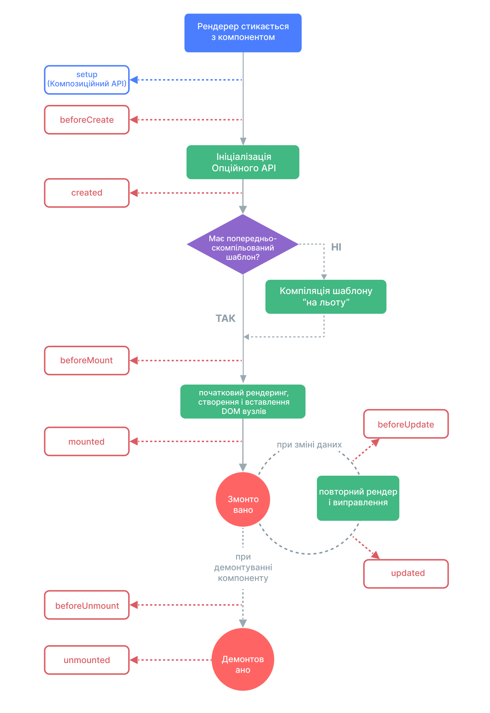

# Lifecycle Hooks {#lifecycle-hooks}

প্রতিটি Vue কম্পোনেন্ট ইন্সট্যান্স তৈরি করার সময় শুরু করার ধাপগুলির একটি সিরিজের মধ্য দিয়ে যায় - উদাহরণস্বরূপ, এটিকে ডেটা পর্যবেক্ষণ সেট আপ করতে হবে, টেমপ্লেট কম্পাইল করতে হবে, ইনস্ট্যান্সটিকে DOM-এ মাউন্ট করতে হবে এবং ডেটা পরিবর্তন হলে DOM আপডেট করতে হবে। পথের পাশাপাশি, এটি লাইফসাইকেল হুক নামে ফাংশনও চালায়, যা ব্যবহারকারীদের নির্দিষ্ট পর্যায়ে তাদের নিজস্ব কোড যোগ করার সুযোগ দেয়।

## Registering Lifecycle Hooks {#registering-lifecycle-hooks}

উদাহরণস্বরূপ, <span class="composition-api">`onMounted`</span><span class="options-api">`mounted`</span> হুকটি কম্পোনেন্ট শেষ হওয়ার পরে কোড চালানোর জন্য ব্যবহার করা যেতে পারে প্রাথমিক রেন্ডারিং এবং DOM নোড তৈরি করেছে:

<div class="composition-api">

```vue
<script setup>
import { onMounted } from 'vue'

onMounted(() => {
  console.log(`the component is now mounted.`)
})
</script>
```

</div>
<div class="options-api">

```js
export default {
  mounted() {
    console.log(`the component is now mounted.`)
  }
}
```

</div>

এছাড়াও আরও কিছু হুক আছে যেগুলোকে ইনস্ট্যান্সের লাইফসাইকেলের বিভিন্ন পর্যায়ে ডাকা হবে, সবচেয়ে বেশি ব্যবহৃত হচ্ছে <span class="composition-api">[`onMounted`](/api/composition-api-lifecycle.html# onmounted), [`onUpdated`](/api/composition-api-lifecycle.html#onupdated), এবং [`onUnmounted`](/api/composition-api-lifecycle.html#onunmounted)।</span><span class="options-api">[`mounted`](/api/options-lifecycle.html#mounted), [`updated`](/api/options-lifecycle.html#updated), এবং [`unmounted`] (/api/options-lifecycle.html#unmounted)।</span>

<div class="options-api">

সমস্ত লাইফসাইকেল হুকগুলিকে তাদের `this` প্রেক্ষাপটে বলা হয় যা বর্তমান সক্রিয় দৃষ্টান্তের দিকে ইঙ্গিত করে। মনে রাখবেন এর অর্থ হল লাইফসাইকেল হুক ঘোষণা করার সময় আপনার তীর ফাংশন ব্যবহার করা এড়ানো উচিত, কারণ আপনি যদি তা করেন তাহলে আপনি `this` এর মাধ্যমে কম্পোনেন্ট ইনস্ট্যান্স অ্যাক্সেস করতে পারবেন না।

</div>

<div class="composition-api">

'onMounted' কল করার সময়, Vue স্বয়ংক্রিয়ভাবে নিবন্ধিত কলব্যাক ফাংশনকে বর্তমান সক্রিয় উপাদান উদাহরণের সাথে সংযুক্ত করে। এর জন্য এই হুকগুলিকে কম্পোনেন্ট সেটআপের সময় **synchronously** নিবন্ধিত হতে হবে। উদাহরণস্বরূপ, এটি করবেন না:

```js
setTimeout(() => {
  onMounted(() => {
    // this won't work.
  })
}, 100)
```

মনে রাখবেন এর মানে এই নয় যে কলটি অবশ্যই লেক্সিকভাবে `setup()` বা `<script setup>`-এর ভিতরে রাখতে হবে। যতক্ষণ না কল স্ট্যাক সিঙ্ক্রোনাস থাকে এবং `setup()` এর মধ্যে থেকে উৎপন্ন হয় ততক্ষণ `onMounted()` একটি বাহ্যিক ফাংশনে কল করা যেতে পারে।

</div>

## Lifecycle Diagram {#lifecycle-diagram}

নীচে উদাহরণ জীবনচক্রের জন্য একটি চিত্র রয়েছে। আপনার এখনই যা চলছে তা সম্পূর্ণরূপে বোঝার দরকার নেই, তবে আপনি যখন আরও শিখবেন এবং আরও তৈরি করবেন, এটি একটি দরকারী রেফারেন্স হবে।



<!-- https://www.figma.com/file/Xw3UeNMOralY6NV7gSjWdS/Vue-Lifecycle -->

পরামর্শ করুন <span class="composition-api">[Lifecycle Hooks API reference](/api/composition-api-lifecycle.html)</span><span class="options-api">[Lifecycle Hooks API reference](/api/options-lifecycle.html)</span> সমস্ত জীবনচক্র হুক এবং তাদের নিজ নিজ ব্যবহারের ক্ষেত্রে বিস্তারিত জানার জন্য।
