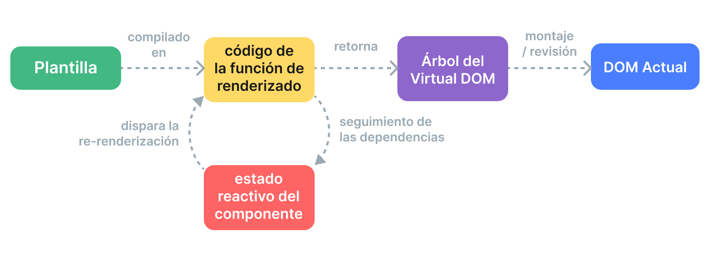

# Rendering Mechanism {#rendering-mechanism}

How does Vue take a template and turn it into actual DOM nodes? How does Vue update those DOM nodes efficiently? We will attempt to shed some light on these questions here by diving into Vue's internal rendering mechanism.

## Virtual DOM {#virtual-dom}

You have probably heard about the term "virtual DOM", which Vue's rendering system is based upon.

The virtual DOM (VDOM) is a programming concept where an ideal, or “virtual”, representation of a UI is kept in memory and synced with the “real” DOM. The concept was pioneered by [React](https://reactjs.org/), and has been adapted in many other frameworks with different implementations, including Vue.

Virtual DOM is more of a pattern than a specific technology, so there is no one canonical implementation. We can illustrate the idea using a simple example:

```js
const vnode = {
  type: 'div',
  props: {
    id: 'hello'
  },
  children: [
    /* more vnodes */
  ]
}
```

Here, `vnode` is a plain JavaScript object (a "virtual node") representing a `<div>` element. It contains all the information that we need to create the actual element. It also contains more children vnodes, which makes it the root of a virtual DOM tree.

A runtime renderer can walk a virtual DOM tree and construct a real DOM tree from it. This process is called **mount**.

If we have two copies of virtual DOM trees, the renderer can also walk and compare the two trees, figuring out the differences, and apply those changes to the actual DOM. This process is called **patch**, also known as "diffing" or "reconciliation".

The main benefit of virtual DOM is that it gives the developer the ability to programmatically create, inspect and compose desired UI structures in a declarative way, while leaving the direct DOM manipulation to the renderer.

## Render Pipeline {#render-pipeline}

At the high level, this is what happens when a Vue component is mounted:

1. **Compile**: Vue templates are compiled into **render functions**: functions that return virtual DOM trees. This step can be done either ahead-of-time via a build step, or on-the-fly by using the runtime compiler.

2. **Mount**: The runtime renderer invokes the render functions, walks the returned virtual DOM tree, and creates actual DOM nodes based on it. This step is performed as a [reactive effect](./reactivity-in-depth), so it keeps track of all reactive dependencies that were used.

3. **Patch**: When a dependency used during mount changes, the effect re-runs. This time, a new, updated Virtual DOM tree is created. The runtime renderer walks the new tree, compares it with the old one, and applies necessary updates to the actual DOM.



<!-- https://www.figma.com/file/elViLsnxGJ9lsQVsuhwqxM/Rendering-Mechanism -->

## Templates vs. Render Functions {#templates-vs-render-functions}

Vue templates are compiled into virtual DOM render functions. Vue also provides APIs that allow us to skip the template compilation step and directly author render functions. Render functions are more flexible than templates when dealing with highly dynamic logic, because you can work with vnodes using the full power of JavaScript.

So why does Vue recommend templates by default? There are a number of reasons:

1. Templates are closer to actual HTML. This makes it easier to reuse existing HTML snippets, apply accessibility best practices, style with CSS, and for designers to understand and modify.

2. Templates are easier to statically analyze due to their more deterministic syntax. This allows Vue's template compiler to apply many compile-time optimizations to improve the performance of the virtual DOM (which we will discuss below).

In practice, templates are sufficient for most use cases in applications. Render functions are typically only used in reusable components that need to deal with highly dynamic rendering logic. Render function usage is discussed in more detail in [Render Functions & JSX](./render-function).

## Compiler-Informed Virtual DOM {#compiler-informed-virtual-dom}

The virtual DOM implementation in React and most other virtual-DOM implementations are purely runtime: the reconciliation algorithm cannot make any assumptions about the incoming virtual DOM tree, so it has to fully traverse the tree and diff the props of every vnode in order to ensure correctness. In addition, even if a part of the tree never changes, new vnodes are always created for them on each re-render, resulting in unnecessary memory pressure. This is one of the most criticized aspect of virtual DOM: the somewhat brute-force reconciliation process sacrifices efficiency in return for declarativeness and correctness.

But it doesn't have to be that way. In Vue, the framework controls both the compiler and the runtime. This allows us to implement many compile-time optimizations that only a tightly-coupled renderer can take advantage of. The compiler can statically analyze the template and leave hints in the generated code so that the runtime can take shortcuts whenever possible. At the same time, we still preserve the capability for the user to drop down to the render function layer for more direct control in edge cases. We call this hybrid approach **Compiler-Informed Virtual DOM**.

Below, we will discuss a few major optimizations done by the Vue template compiler to improve the virtual DOM's runtime performance.

### Static Hoisting {#static-hoisting}

Quite often there will be parts in a template that do not contain any dynamic bindings:

```vue-html{2-3}
<div>
  <div>foo</div> <!-- hoisted -->
  <div>bar</div> <!-- hoisted -->
  <div>{{ dynamic }}</div>
</div>
```

[Inspect in Template Explorer](https://template-explorer.vuejs.org/#eyJzcmMiOiI8ZGl2PlxuICA8ZGl2PmZvbzwvZGl2PiA8IS0tIGhvaXN0ZWQgLS0+XG4gIDxkaXY+YmFyPC9kaXY+IDwhLS0gaG9pc3RlZCAtLT5cbiAgPGRpdj57eyBkeW5hbWljIH19PC9kaXY+XG48L2Rpdj5cbiIsIm9wdGlvbnMiOnsiaG9pc3RTdGF0aWMiOnRydWV9fQ==)

The `foo` and `bar` divs are static - re-creating vnodes and diffing them on each re-render is unnecessary. The Vue compiler automatically hoists their vnode creation calls out of the render function, and reuses the same vnodes on every render. The renderer is also able to completely skip diffing them when it notices the old vnode and the new vnode are the same one.

In addition, when there are enough consecutive static elements, they will be condensed into a single "static vnode" that contains the plain HTML string for all these nodes ([Example](https://template-explorer.vuejs.org/#eyJzcmMiOiI8ZGl2PlxuICA8ZGl2IGNsYXNzPVwiZm9vXCI+Zm9vPC9kaXY+XG4gIDxkaXYgY2xhc3M9XCJmb29cIj5mb288L2Rpdj5cbiAgPGRpdiBjbGFzcz1cImZvb1wiPmZvbzwvZGl2PlxuICA8ZGl2IGNsYXNzPVwiZm9vXCI+Zm9vPC9kaXY+XG4gIDxkaXYgY2xhc3M9XCJmb29cIj5mb288L2Rpdj5cbiAgPGRpdj57eyBkeW5hbWljIH19PC9kaXY+XG48L2Rpdj4iLCJzc3IiOmZhbHNlLCJvcHRpb25zIjp7ImhvaXN0U3RhdGljIjp0cnVlfX0=)). These static vnodes are mounted by directly setting `innerHTML`. They also cache their corresponding DOM nodes on initial mount - if the same piece of content is reused elsewhere in the app, new DOM nodes are created using native `cloneNode()`, which is extremely efficient.

### Patch Flags {#patch-flags}

For a single element with dynamic bindings, we can also infer a lot of information from it at compile time:

```vue-html
<!-- class binding only -->
<div :class="{ active }"></div>

<!-- id and value bindings only -->
<input :id="id" :value="value">

<!-- text children only -->
<div>{{ dynamic }}</div>
```

[Inspect in Template Explorer](https://template-explorer.vuejs.org/#eyJzcmMiOiI8ZGl2IDpjbGFzcz1cInsgYWN0aXZlIH1cIj48L2Rpdj5cblxuPGlucHV0IDppZD1cImlkXCIgOnZhbHVlPVwidmFsdWVcIj5cblxuPGRpdj57eyBkeW5hbWljIH19PC9kaXY+Iiwib3B0aW9ucyI6e319)

When generating the render function code for these elements, Vue encodes the type of update each of them needs directly in the vnode creation call:

```js{3}
createElementVNode("div", {
  class: _normalizeClass({ active: _ctx.active })
}, null, 2 /* CLASS */)
```

The last argument, `2`, is a [patch flag](https://github.com/vuejs/core/blob/main/packages/shared/src/patchFlags.ts). An element can have multiple patch flags, which will be merged into a single number. The runtime renderer can then check against the flags using [bitwise operations](https://en.wikipedia.org/wiki/Bitwise_operation) to determine whether it needs to do certain work:

```js
if (vnode.patchFlag & PatchFlags.CLASS /* 2 */) {
  // update the element's class
}
```

Bitwise checks are extremely fast. With the patch flags, Vue is able to do the least amount of work necessary when updating elements with dynamic bindings.

Vue also encodes the type of children a vnode has. For example, a template that has multiple root nodes is represented as a fragment. In most cases, we know for sure that the order of these root nodes will never change, so this information can also be provided to the runtime as a patch flag:

```js{4}
export function render() {
  return (_openBlock(), _createElementBlock(_Fragment, null, [
    /* children */
  ], 64 /* STABLE_FRAGMENT */))
}
```

The runtime can thus completely skip child-order reconciliation for the root fragment.

### Tree Flattening {#tree-flattening}

Taking another look at the generated code from the previous example, you'll notice the root of the returned virtual DOM tree is created using a special `createElementBlock()` call:

```js{2}
export function render() {
  return (_openBlock(), _createElementBlock(_Fragment, null, [
    /* children */
  ], 64 /* STABLE_FRAGMENT */))
}
```

Conceptually, a "block" is a part of the template that has stable inner structure. In this case, the entire template has a single block because it does not contain any structural directives like `v-if` and `v-for`.

Each block tracks any descendant nodes (not just direct children) that have patch flags. For example:

```vue-html{3,5}
<div> <!-- root block -->
  <div>...</div>         <!-- not tracked -->
  <div :id="id"></div>   <!-- tracked -->
  <div>                  <!-- not tracked -->
    <div>{{ bar }}</div> <!-- tracked -->
  </div>
</div>
```

The result is a flattened array that contains only the dynamic descendant nodes:

```
div (block root)
- div with :id binding
- div with {{ bar }} binding
```

When this component needs to re-render, it only needs to traverse the flattened tree instead of the full tree. This is called **Tree Flattening**, and it greatly reduces the number of nodes that need to be traversed during virtual DOM reconciliation. Any static parts of the template are effectively skipped.

`v-if` and `v-for` directives will create new block nodes:

```vue-html
<div> <!-- root block -->
  <div>
    <div v-if> <!-- if block -->
      ...
    <div>
  </div>
</div>
```

A child block is tracked inside the parent block's array of dynamic descendants. This retains a stable structure for the parent block.

### Impact on SSR Hydration {#impact-on-ssr-hydration}

Both patch flags and tree flattening also greatly improve Vue's [SSR Hydration](/guide/scaling-up/ssr.html#client-hydration) performance:

- Single element hydration can take fast paths based on the corresponding vnode's patch flag.

- Only block nodes and their dynamic descendants need to be traversed during hydration, effectively achieving partial hydration at the template level.
