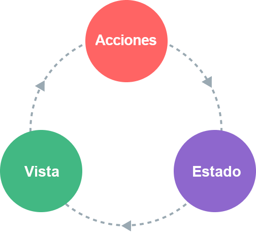

# State Management {#state-management}

## What is State Management? {#what-is-state-management}

Technically, every Vue component instance already "manages" its own reactive state. Take a simple counter component as an example:

<div class="composition-api">

```vue
<script setup>
import { ref } from 'vue'

// state
const count = ref(0)

// actions
function increment() {
  count.value++
}
</script>

<!-- view -->
<template>{{ count }}</template>
```

</div>
<div class="options-api">

```vue
<script>
export default {
  // state
  data() {
    return {
      count: 0
    }
  },
  // actions
  methods: {
    increment() {
      this.count++
    }
  }
}
</script>

<!-- view -->
<template>{{ count }}</template>
```

</div>

It is a self-contained unit with the following parts:

- The **state**, the source of truth that drives our app;
- The **view**, a declarative mapping of the **state**;
- The **actions**, the possible ways the state could change in reaction to user inputs from the **view**.

This is a simple representation of the concept of "one-way data flow":

<p style="text-align: center">
  
</p>

However, the simplicity starts to break down when we have **multiple components that share a common state**:

1. Multiple views may depend on the same piece of state.
2. Actions from different views may need to mutate the same piece of state.

For case one, a possible workaround is by "lifting" the shared state up to a common ancestor component, and then pass it down as props. However, this quickly gets tedious in component trees with deep hierarchies, leading to another problem known as [Prop Drilling](/guide/components/provide-inject.html#prop-drilling).

For case two, we often find ourselves resorting to solutions such as reaching for direct parent / child instances via template refs, or trying to mutate and synchronize multiple copies of the state via emitted events. Both of these patterns are brittle and quickly lead to unmaintainable code.

A simpler and more straightforward solution is to extract the shared state out of the components, and manage it in a global singleton. With this, our component tree becomes a big "view", and any component can access the state or trigger actions, no matter where they are in the tree!

## Simple State Management with Reactivity API {#simple-state-management-with-reactivity-api}

<div class="options-api">

In Options API, reactive data is declared using the `data()` option. Internally, the object returned by `data()` is made reactive via the [`reactive()`](/api/reactivity-core.html#reactive) function, which is also available as a public API.

</div>

If you have a piece of state that should be shared by multiple instances, you can use [`reactive()`](/api/reactivity-core.html#reactive) to create a reactive object, and then import it into multiple components:

```js
// store.js
import { reactive } from 'vue'

export const store = reactive({
  count: 0
})
```

<div class="composition-api">

```vue
<!-- ComponentA.vue -->
<script setup>
import { store } from './store.js'
</script>

<template>From A: {{ store.count }}</template>
```

```vue
<!-- ComponentB.vue -->
<script setup>
import { store } from './store.js'
</script>

<template>From B: {{ store.count }}</template>
```

</div>
<div class="options-api">

```vue
<!-- ComponentA.vue -->
<script>
import { store } from './store.js'

export default {
  data() {
    return {
      store
    }
  }
}
</script>

<template>From A: {{ store.count }}</template>
```

```vue
<!-- ComponentB.vue -->
<script>
import { store } from './store.js'

export default {
  data() {
    return {
      store
    }
  }
}
</script>

<template>From B: {{ store.count }}</template>
```

</div>

Now whenever the `store` object is mutated, both `<ComponentA>` and `<ComponentB>` will update their views automatically - we have a single source of truth now.

However, this also means any component importing `store` can mutate it however they want:

```vue-html{2}
<template>
  <button @click="store.count++">
    From B: {{ store.count }}
  </button>
</template>
```

While this works in simple cases, global state that can be arbitrarily mutated by any component is not going to be very maintainable in the long run. To ensure the state-mutating logic is centralized like the state itself, it is recommended to define methods on the store with names that express the intention of the actions:

```js{6-8}
// store.js
import { reactive } from 'vue'

export const store = reactive({
  count: 0,
  increment() {
    this.count++
  }
})
```

```vue-html{2}
<template>
  <button @click="store.increment()">
    From B: {{ store.count }}
  </button>
</template>
```

<div class="composition-api">

[Try it in the Playground](https://sfc.vuejs.org/#eyJBcHAudnVlIjoiPHNjcmlwdCBzZXR1cD5cbmltcG9ydCBDb21wb25lbnRBIGZyb20gJy4vQ29tcG9uZW50QS52dWUnXG5pbXBvcnQgQ29tcG9uZW50QiBmcm9tICcuL0NvbXBvbmVudEIudnVlJ1xuPC9zY3JpcHQ+XG5cbjx0ZW1wbGF0ZT5cbiAgPENvbXBvbmVudEEgLz5cbiAgPENvbXBvbmVudEIgLz5cbjwvdGVtcGxhdGU+IiwiaW1wb3J0LW1hcC5qc29uIjoie1xuICBcImltcG9ydHNcIjoge1xuICAgIFwidnVlXCI6IFwiaHR0cHM6Ly9zZmMudnVlanMub3JnL3Z1ZS5ydW50aW1lLmVzbS1icm93c2VyLmpzXCJcbiAgfVxufSIsIkNvbXBvbmVudEEudnVlIjoiPHNjcmlwdCBzZXR1cD5cbmltcG9ydCB7IHN0b3JlIH0gZnJvbSAnLi9zdG9yZS5qcydcbjwvc2NyaXB0PlxuXG48dGVtcGxhdGU+XG4gIDxkaXY+XG4gICAgPGJ1dHRvbiBAY2xpY2s9XCJzdG9yZS5pbmNyZW1lbnQoKVwiPlxuICAgICAgRnJvbSBBOiB7eyBzdG9yZS5jb3VudCB9fVxuICAgIDwvYnV0dG9uPlxuICA8L2Rpdj5cbjwvdGVtcGxhdGU+IiwiQ29tcG9uZW50Qi52dWUiOiI8c2NyaXB0IHNldHVwPlxuaW1wb3J0IHsgc3RvcmUgfSBmcm9tICcuL3N0b3JlLmpzJ1xuPC9zY3JpcHQ+XG5cbjx0ZW1wbGF0ZT5cbiAgPGRpdj5cbiAgICA8YnV0dG9uIEBjbGljaz1cInN0b3JlLmluY3JlbWVudCgpXCI+XG4gICAgICBGcm9tIEI6IHt7IHN0b3JlLmNvdW50IH19XG4gICAgPC9idXR0b24+XG4gIDwvZGl2PlxuPC90ZW1wbGF0ZT4iLCJzdG9yZS5qcyI6ImltcG9ydCB7IHJlYWN0aXZlIH0gZnJvbSAndnVlJ1xuXG5leHBvcnQgY29uc3Qgc3RvcmUgPSByZWFjdGl2ZSh7XG4gIGNvdW50OiAwLFxuICBpbmNyZW1lbnQoKSB7XG4gICAgdGhpcy5jb3VudCsrXG4gIH1cbn0pIn0=)

</div>
<div class="options-api">

[Try it in the Playground](https://sfc.vuejs.org/#eyJBcHAudnVlIjoiPHNjcmlwdD5cbmltcG9ydCBDb21wb25lbnRBIGZyb20gJy4vQ29tcG9uZW50QS52dWUnXG5pbXBvcnQgQ29tcG9uZW50QiBmcm9tICcuL0NvbXBvbmVudEIudnVlJ1xuICBcbmV4cG9ydCBkZWZhdWx0IHtcbiAgY29tcG9uZW50czoge1xuICAgIENvbXBvbmVudEEsXG4gICAgQ29tcG9uZW50QlxuICB9XG59XG48L3NjcmlwdD5cblxuPHRlbXBsYXRlPlxuICA8Q29tcG9uZW50QSAvPlxuICA8Q29tcG9uZW50QiAvPlxuPC90ZW1wbGF0ZT4iLCJpbXBvcnQtbWFwLmpzb24iOiJ7XG4gIFwiaW1wb3J0c1wiOiB7XG4gICAgXCJ2dWVcIjogXCJodHRwczovL3NmYy52dWVqcy5vcmcvdnVlLnJ1bnRpbWUuZXNtLWJyb3dzZXIuanNcIlxuICB9XG59IiwiQ29tcG9uZW50QS52dWUiOiI8c2NyaXB0PlxuaW1wb3J0IHsgc3RvcmUgfSBmcm9tICcuL3N0b3JlLmpzJ1xuXG5leHBvcnQgZGVmYXVsdCB7XG4gIGRhdGEoKSB7XG4gICAgcmV0dXJuIHtcbiAgICAgIHN0b3JlXG4gICAgfVxuICB9XG59XG48L3NjcmlwdD5cblxuPHRlbXBsYXRlPlxuICA8ZGl2PlxuICAgIDxidXR0b24gQGNsaWNrPVwic3RvcmUuaW5jcmVtZW50KClcIj5cbiAgICAgIEZyb20gQToge3sgc3RvcmUuY291bnQgfX1cbiAgICA8L2J1dHRvbj5cbiAgPC9kaXY+XG48L3RlbXBsYXRlPiIsIkNvbXBvbmVudEIudnVlIjoiPHNjcmlwdD5cbmltcG9ydCB7IHN0b3JlIH0gZnJvbSAnLi9zdG9yZS5qcydcblxuZXhwb3J0IGRlZmF1bHQge1xuICBkYXRhKCkge1xuICAgIHJldHVybiB7XG4gICAgICBzdG9yZVxuICAgIH1cbiAgfVxufVxuPC9zY3JpcHQ+XG5cbjx0ZW1wbGF0ZT5cbiAgPGRpdj5cbiAgICA8YnV0dG9uIEBjbGljaz1cInN0b3JlLmluY3JlbWVudCgpXCI+XG4gICAgICBGcm9tIEI6IHt7IHN0b3JlLmNvdW50IH19XG4gICAgPC9idXR0b24+XG4gIDwvZGl2PlxuPC90ZW1wbGF0ZT4iLCJzdG9yZS5qcyI6ImltcG9ydCB7IHJlYWN0aXZlIH0gZnJvbSAndnVlJ1xuXG5leHBvcnQgY29uc3Qgc3RvcmUgPSByZWFjdGl2ZSh7XG4gIGNvdW50OiAwLFxuICBpbmNyZW1lbnQoKSB7XG4gICAgdGhpcy5jb3VudCsrXG4gIH1cbn0pIn0=)

</div>

:::tip
Note the click handler uses `store.increment()` with parentheses - this is necessary to call the method with the proper `this` context since it's not a component method.
:::

Although here we are using a single reactive object as a store, you can also share reactive state created using other [Reactivity APIs](/api/reactivity-core.html) such as `ref()` or `computed()`, or even return global state from a [Composable](/guide/reusability/composables.html):

```js
import { ref } from 'vue'

// global state, created in module scope
const globalCount = ref(1)

export function useCount() {
  // local state, created per-component
  const localCount = ref(1)

  return {
    globalCount,
    localCount
  }
}
```

The fact that Vue's reactivity system is decoupled from the component model makes it extremely flexible.

## SSR Considerations {#ssr-considerations}

If you are building an application that leverages [Server-Side Rendering (SSR)](./ssr), the above pattern can lead to issues due to the store being a singleton shared across multiple requests. This is discussed in [more details](./ssr#cross-request-state-pollution) in the SSR guide.

## Pinia {#pinia}

While our hand-rolled state management solution will suffice in simple scenarios, there are many more things to consider in large-scale production applications:

- Stronger conventions for team collaboration
- Integrating with the Vue DevTools, including timeline, in-component inspection, and time-travel debugging
- Hot Module Replacement
- Server-Side Rendering support

[Pinia](https://pinia.vuejs.org) is a state management library that implements all of the above. It is maintained by the Vue core team, and works with both Vue 2 and Vue 3.

Existing users may be familiar with [Vuex](https://vuex.vuejs.org/), the previous official state management library for Vue. With Pinia serving the same role in the ecosystem, Vuex is now in maintenance mode. It still works, but will no longer receive new features. It is recommended to use Pinia for new applications.

Pinia started out as an exploration of what the next iteration of Vuex could look like, incorporating many ideas from core team discussions for Vuex 5. Eventually, we realized that Pinia already implements most of what we wanted in Vuex 5, and decided to make it the new recommendation instead.

Compared to Vuex, Pinia provides a simpler API with less ceremony, offers Composition-API-style APIs, and most importantly, has solid type inference support when used with TypeScript.
