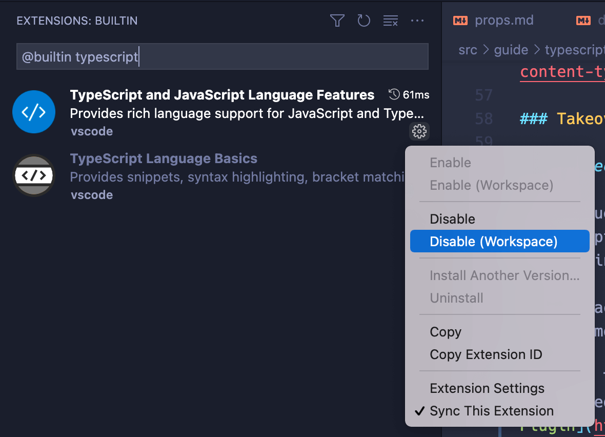

# Using Vue with TypeScript {#using-vue-with-typescript}

A type system like TypeScript can detect many common errors via static analysis at build time. This reduces the chance of runtime errors in production, and also allows us to more confidently refactor code in large-scale applications. TypeScript also improves developer ergonomics via type-based auto-completion in IDEs.

Vue is written in TypeScript itself and provides first-class TypeScript support. All official Vue packages come with bundled type declarations that should work out-of-the-box.

## Project Setup {#project-setup}

[`create-vue`](https://github.com/vuejs/create-vue), the official project scaffolding tool, offers the options to scaffold a [Vite](https://vitejs.dev/)-powered, TypeScript-ready Vue project.

### Overview {#overview}

With a Vite-based setup, the dev server and the bundler are transpilation-only and do not perform any type-checking. This ensures the Vite dev server stays blazing fast even when using TypeScript.

- During development, we recommend relying on a good [IDE setup](#ide-support) for instant feedback on type errors.

- If using SFCs, use the [`vue-tsc`](https://github.com/johnsoncodehk/volar/tree/master/vue-language-tools/vue-tsc) utility for command line type checking and type declaration generation. `vue-tsc` is a wrapper around `tsc`, TypeScript's own command line interface. It works largely the same as `tsc` except that it supports Vue SFCs in addition to TypeScript files. You can run `vue-tsc` in watch mode in parallel to the Vite dev server, or use a Vite plugin like [vite-plugin-checker](https://vite-plugin-checker.netlify.app/) which runs the checks in a separate worker thread.

- Vue CLI also provides TypeScript support, but is no longer recommended. See [notes below](#note-on-vue-cli-and-ts-loader).

### IDE Support {#ide-support}

- [Visual Studio Code](https://code.visualstudio.com/) (VSCode) is strongly recommended for its great out-of-the-box support for TypeScript.

  - [Volar](https://marketplace.visualstudio.com/items?itemName=Vue.volar) is the official VSCode extension that provides TypeScript support inside Vue SFCs, along with many other great features.

    :::tip
    Volar replaces [Vetur](https://marketplace.visualstudio.com/items?itemName=octref.vetur), our previous official VSCode extension for Vue 2. If you have Vetur currently installed, make sure to disable it in Vue 3 projects.
    :::

  - [TypeScript Vue Plugin](https://marketplace.visualstudio.com/items?itemName=Vue.vscode-typescript-vue-plugin) is also needed to get type support for `*.vue` imports in TS files.

- [WebStorm](https://www.jetbrains.com/webstorm/) also provides out-of-the-box support for both TypeScript and Vue. Other JetBrains IDEs support them too, either out of the box or via [a free plugin](https://plugins.jetbrains.com/plugin/9442-vue-js).

### Configuring `tsconfig.json` {#configuring-tsconfig-json}

Projects scaffolded via `create-vue` include pre-configured `tsconfig.json`. The base config is abstracted in the [`@vue/tsconfig`](https://github.com/vuejs/tsconfig) package. Inside the project, we use [Project References](https://www.typescriptlang.org/docs/handbook/project-references.html) to ensure correct types for code running in different environments (e.g. app code and test code should have different global variables).

When configuring `tsconfig.json` manually, some notable options include:

- [`compilerOptions.isolatedModules`](https://www.typescriptlang.org/tsconfig#isolatedModules) is set to `true` because Vite uses [esbuild](https://esbuild.github.io/) for transpiling TypeScript and is subject to single-file transpile limitations.

- If you're using Options API, you need to set [`compilerOptions.strict`](https://www.typescriptlang.org/tsconfig#strict) to `true` (or at least enable [`compilerOptions.noImplicitThis`](https://www.typescriptlang.org/tsconfig#noImplicitThis), which is a part of the `strict` flag) to leverage type checking of `this` in component options. Otherwise `this` will be treated as `any`.

- If you have configured resolver aliases in your build tool, for example the `@/*` alias configured by default in a `create-vue` project, you need to also configure it for TypeScript via [`compilerOptions.paths`](https://www.typescriptlang.org/tsconfig#paths).

See also:

- [Official TypeScript compiler options docs](https://www.typescriptlang.org/docs/handbook/compiler-options.html)
- [esbuild TypeScript compilation caveats](https://esbuild.github.io/content-types/#typescript-caveats)

### Volar Takeover Mode {#volar-takeover-mode}

> This section only applies for VSCode + Volar.

To get Vue SFCs and TypeScript working together, Volar creates a separate TS language service instance patched with Vue-specific support, and uses it in Vue SFCs. At the same time, plain TS files are still handled by VSCode's built-in TS language service, which is why we need [TypeScript Vue Plugin](https://marketplace.visualstudio.com/items?itemName=Vue.vscode-typescript-vue-plugin) to support Vue SFC imports in TS files. This default setup works, but for each project we are running two TS language service instances: one from Volar, one from VSCode's built-in service. This is a bit inefficient and can lead to performance issues in large projects.

Volar provides a feature called "Takeover Mode" to improve performance. In takeover mode, Volar provides support for both Vue and TS files using a single TS language service instance.

To enable Takeover Mode, you need to disable VSCode's built-in TS language service in **your project's workspace only** by following these steps:

1. In your project workspace, bring up the command palette with `Ctrl + Shift + P` (macOS: `Cmd + Shift + P`).
2. Type `built` and select "Extensions: Show Built-in Extensions".
3. Type `typescript` in the extension search box (do not remove `@builtin` prefix).
4. Click the little gear icon of "TypeScript and JavaScript Language Features", and select "Disable (Workspace)".
5. Reload the workspace. Takeover mode will be enabled when you open a Vue or TS file.



### Note on Vue CLI and `ts-loader` {#note-on-vue-cli-and-ts-loader}

In webpack-based setups such as Vue CLI, it is common to perform type checking as part of the module transform pipeline, for example with `ts-loader`. This, however, isn't a clean solution because the type system needs knowledge of the entire module graph to perform type checks. Individual module's transform step simply is not the right place for the task. It leads to the following problems:

- `ts-loader` can only type check post-transform code. This doesn't align with the errors we see in IDEs or from `vue-tsc`, which map directly back to the source code.

- Type checking can be slow. When it is performed in the same thread / process with code transformations, it significantly affects the build speed of the entire application.

- We already have type checking running right in our IDE in a separate process, so the cost of dev experience slow down simply isn't a good trade-off.

If you are currently using Vue 3 + TypeScript via Vue CLI, we strongly recommend migrating over to Vite. We are also working on CLI options to enable transpile-only TS support, so that you can switch to `vue-tsc` for type checking.

## General Usage Notes {#general-usage-notes}

### `defineComponent()` {#definecomponent}

To let TypeScript properly infer types inside component options, we need to define components with [`defineComponent()`](/api/general.html#definecomponent):

```ts
import { defineComponent } from 'vue'

export default defineComponent({
  // type inference enabled
  props: {
    name: String,
    msg: { type: String, required: true }
  },
  data() {
    return {
      count: 1
    }
  },
  mounted() {
    this.name // type: string | undefined
    this.msg // type: string
    this.count // type: number
  }
})
```

`defineComponent()` also supports inferring the props passed to `setup()` when using Composition API without `<script setup>`:

```ts
import { defineComponent } from 'vue'

export default defineComponent({
  // type inference enabled
  props: {
    message: String
  },
  setup(props) {
    props.message // type: string | undefined
  }
})
```

See also:

- [Note on webpack Treeshaking](/api/general.html#note-on-webpack-treeshaking)
- [type tests for `defineComponent`](https://github.com/vuejs/core/blob/main/test-dts/defineComponent.test-d.tsx)

:::tip
`defineComponent()` also enables type inference for components defined in plain JavaScript.
:::

### Usage in Single-File Components {#usage-in-single-file-components}

To use TypeScript in SFCs, add the `lang="ts"` attribute to `<script>` tags. When `lang="ts"` is present, all template expressions also enjoy stricter type checking.

```vue
<script lang="ts">
import { defineComponent } from 'vue'

export default defineComponent({
  data() {
    return {
      count: 1
    }
  }
})
</script>

<template>
  <!-- type checking and auto-completion enabled -->
  {{ count.toFixed(2) }}
</template>
```

`lang="ts"` can also be used with `<script setup>`:

```vue
<script setup lang="ts">
// TypeScript enabled
import { ref } from 'vue'

const count = ref(1)
</script>

<template>
  <!-- type checking and auto-completion enabled -->
  {{ count.toFixed(2) }}
</template>
```

### TypeScript in Templates {#typescript-in-templates}

The `<template>` also supports TypeScript in binding expressions when `<script lang="ts">` or `<script setup lang="ts">` is used. This is useful in cases where you need to perform type casting in template expressions.

Here's a contrived example:

```vue
<script setup lang="ts">
let x: string | number = 1
</script>

<template>
  <!-- error because x could be a string -->
  {{ x.toFixed(2) }}
</template>
```

This can be worked around with an inline type cast:

```vue{6}
<script setup lang="ts">
let x: string | number = 1
</script>

<template>
  {{ (x as number).toFixed(2) }}
</template>
```

:::tip
If using Vue CLI or a webpack-based setup, TypeScript in template expressions requires `vue-loader@^16.8.0`.
:::

## API-Specific Recipes {#api-specific-recipes}

- [TS with Composition API](./composition-api)
- [TS with Options API](./options-api)
